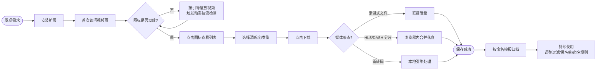
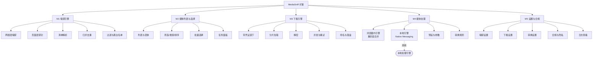
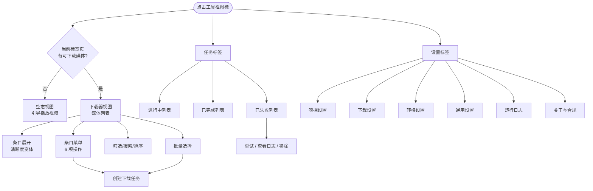
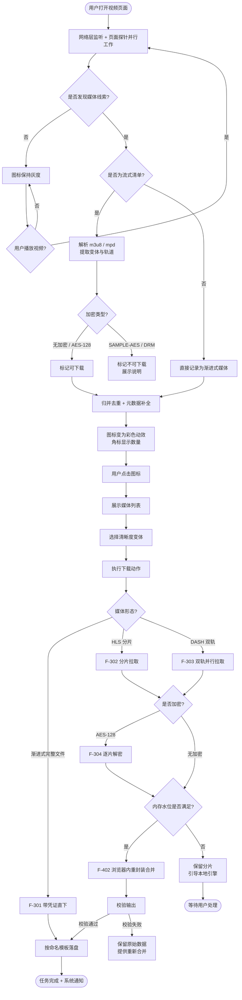
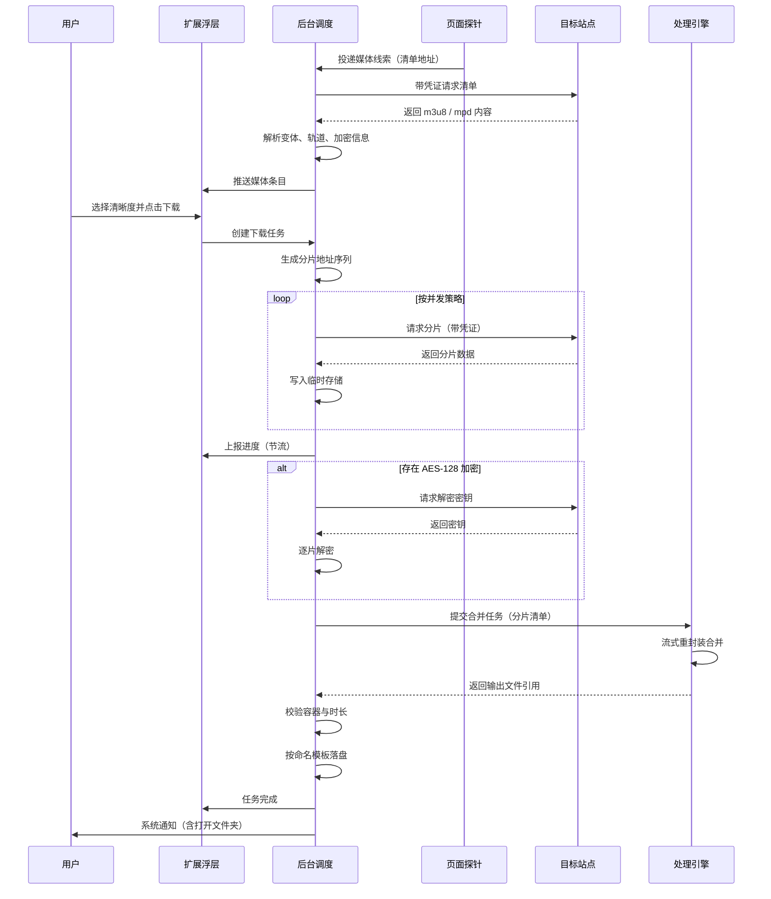
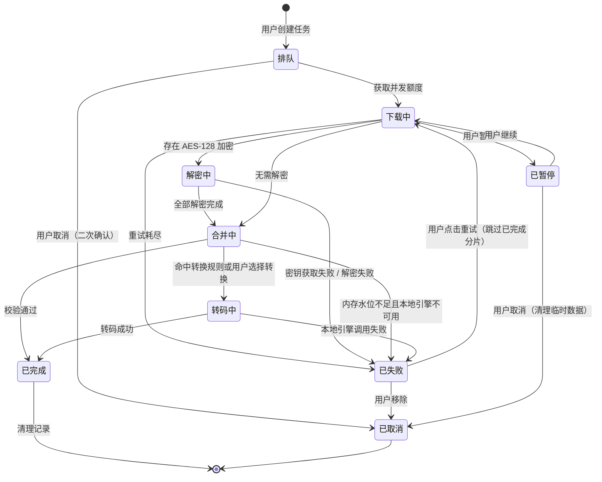
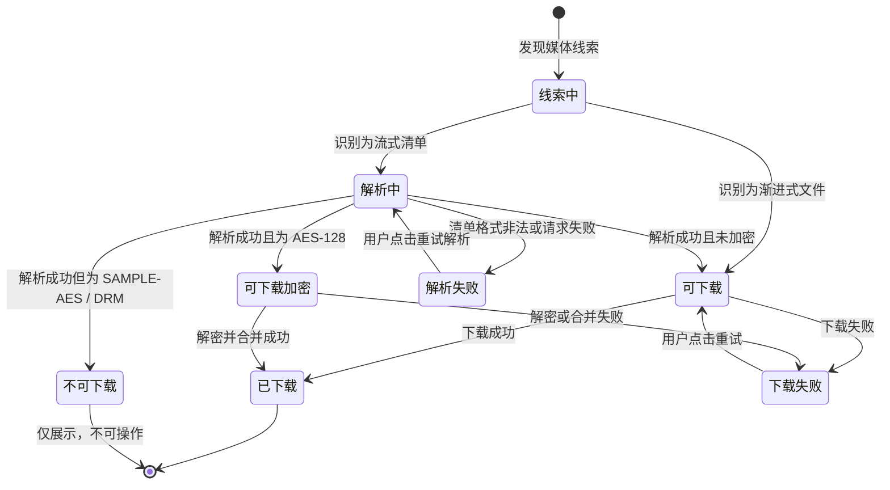
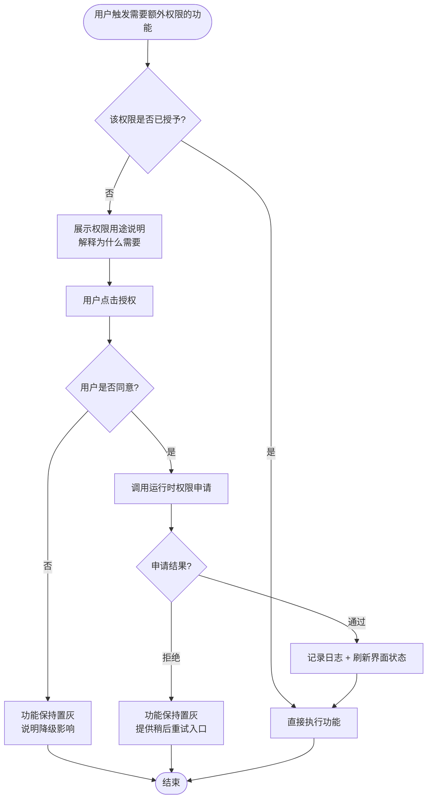

# MediaSniff（媒探）视频资源嗅探与下载扩展 需求文档说明书

## 文档信息

| 项目 | 内容 |
|------|------|
| 产品名称 | MediaSniff（中文名：媒探） |
| 产品形态 | 浏览器扩展（Chrome / Edge，Manifest V3），可选本地处理引擎 |
| 文档版本 | V1.0 |
| 文档类型 | 新项目立项 PRD |
| 编写日期 | 2026-09-18 |
| 编写人 | 老梁（需求方）／沙杯（PRD 架构） |
| 评审状态 | 待评审 |
| 功能基线 | Video DownloadHelper v10.5.2.2（已剥离会员相关能力，详见附录 D） |
| 关联文档 | `docs/research/2026-09-18-video-downloadhelper-feature-map.md` |

## 修订记录

| 版本 | 日期 | 修订人 | 修订内容 |
|------|------|--------|----------|
| V1.0 | 2026-09-18 | 沙杯 | 初始版本。基于 Video DownloadHelper 功能全景调研，剥离全部会员/许可证/远程解析能力，产出自研产品需求基线 |

---

## 方案选型结论（TL;DR）

动笔前先定四件事，后续所有设计都受这四条约束：

| 决策项 | 结论 | 理由 |
|--------|------|------|
| 平台范围 | **仅 Chrome / Edge，Manifest V3** | 同内核单套代码；避开 Firefox 在 webRequest / background 上的语义差异。要求 Chrome ≥ 109（Offscreen Document 能力基线） |
| 嗅探机制 | **网络层监听 + 页面上下文探针 + DOM 扫描，三路并行** | 只用网络监听必漏。现代站点普遍用 hls.js / dash.js 在 JS 内拉流后喂给 MSE，网络层抓不到分片归属；必须叠加页面上下文挂钩 |
| 媒体处理 | **双通道：浏览器内 WebAssembly 引擎（默认，零安装）+ 本地引擎（选装，能力全开）** | 原插件连 HLS 合并都要装配套程序，这是它最大的体验缺陷。自研方案让免重编码的合并封装在浏览器内完成（remux 是 I/O 密集而非 CPU 密集，WebAssembly 完全够用），把真正的重编码转码交给选装的本地引擎 |
| 媒体类型 | **视频 + 音频** | 覆盖播客/音乐站与纯音频轨抽取；不含图片批量抓取（与原插件的「图片库」能力做减法，避免范围膨胀） |

**关于原插件方案的真实情况（回答「按效果最好的方式来」）**：原插件用的是 **Native Messaging + 本地配套程序 `VdhCoApp`（Node.js + ffmpeg）**。扩展侧只做嗅探与编排，所有合并与转换都甩给本地程序。这个方案优点是能力上限高、性能接近原生；缺点是**用户必须先装一个桌面程序才能下载分片流**，安装漏斗损耗大，且需要处理跨平台打包、代码签名、浏览器注册等一堆工程问题。

**本方案的选择**：不照抄。采用「双引擎 + 能力降级」策略——默认路径完全在浏览器内跑通（HLS/DASH 分片合并、AES-128 解密、容器重封装），用户装完扩展即可用；对重编码转码、超大文件、本地文件转换这三类真正需要原生性能的场景，才引导安装本地引擎。这样既拿到原插件的完整能力，又消掉它的安装门槛。

---

## 1. 背景介绍

### 1.1 业务背景

网页视频的承载方式在过去十年发生了根本变化。早期视频是服务端提供一个完整文件（渐进式 MP4），浏览器直接请求即可；而如今主流站点普遍采用 **HLS（HTTP Live Streaming）** 或 **DASH（Dynamic Adaptive Streaming over HTTP）**，视频被切成数百上千个分片，由页面内的 JavaScript 播放器按网络状况动态拉取并喂给 Media Source Extensions（MSE）播放。旁路下载的难度因此从「找到那个 URL」变成了「找到那个 URL、解析清单、拉齐分片、处理加密、再拼回一个可播放的文件」。

浏览器出于版权保护与安全沙箱的考虑，不提供任何原生的「保存页面中的视频」能力。视频下载类扩展因此长期存在真实需求，Video DownloadHelper 是其中的头部产品，官方自述约 20M+ 用户、1,000+ 支持站点、持续维护近 20 年。

但这类产品同时面临两组张力：一是**能力与安装门槛的张力**——强大能力被放在了需要额外安装的桌面程序里；二是**免费与商业化的张力**——头部产品普遍采用免费增值模式，把「无限下载」「去水印」「远程解析」划入付费墙。

本项目要做的事情很明确：**完整继承前者（嗅探与下载能力），彻底放弃后者（会员体系）**，并把被原产品放在桌面程序里的核心能力尽可能搬回浏览器内。

### 1.2 现状分析

| 痛点 | 受影响用户 | 现有方案 | 痛点程度 |
|------|-----------|----------|----------|
| 分片流（HLS/DASH）下载必须额外安装桌面程序 | 全部非技术用户 | Video DownloadHelper + 配套程序 | 高 |
| 免费版存在下载额度与转换水印，付费墙打断核心流程 | 高频使用者 | 付费解锁 | 中 |
| 复杂链接依赖服务端远程解析，需填 API Key 且离线不可用 | 遇到加密/防盗链站点的用户 | VIP Server | 中 |
| 多个不同来源的视频散落列表，命名混乱难以整理 | 内容采集/学习资料整理者 | 手工重命名 | 中 |
| 不装桌面程序时，音视频分离轨（DASH）只能下到半成品 | 需要高清源的用户 | 无解 | 高 |
| 播放器用 JS 拉流的站点检测不到媒体 | 全部用户 | 只能刷新/重试 | 中 |

### 1.3 竞品参考：Video DownloadHelper 功能全景

原产品共 6 大能力域，其中 M4（媒体处理）完全依赖本地配套程序：

| 能力域 | 主要功能 | 是否依赖桌面程序 |
|--------|----------|------------------|
| M1 媒体嗅探 | 网络请求嗅探、流式清单识别、页面元素扫描、图标状态驱动、条目归并、元数据补全、类型分类、域名黑名单、检测过滤 | 否 |
| M2 列表与选择 | 三标签页界面（下载器/设置/日志）、媒体列表、清晰度变体展开、搜索、排序、批量选择、单条操作、加密标记、进度展示 | 否 |
| M3 下载引擎 | 渐进式直下、带请求头下载、HLS 分片合并、DASH 音视频合并、加密流处理、断点续传、并发控制、命名模板、保存位置 | 部分（合并/续传需程序） |
| M4 媒体处理 | 音视频聚合、Download / Quick Download / Download & Convert、本地文件转换、输出预设、参数微调、预设管理、转换规则、引擎检测 | **全部依赖** |
| M5 设置 | 通用/检测/下载/转换/日志/隐私六组设置 | 否 |
| M6 能力边界 | 不支持 YouTube（Chrome 版）、不支持 DRM 内容、部分站点需先播放 | — |

**剥离的会员（Premium）能力共 9 项**：下载额度限制、转换产物水印、VIP Server 远程解析、许可证购买激活找回、服务端加速处理、跨浏览器许可证同步、Rapid Release 抢先通道、升级引导 UI、账号绑定。逐项剥离决策见 **附录 D**。

### 1.4 产品定位

> **为需要长期保存网页视频的个人用户，提供一个「装完即用、无付费墙、全程本地」的视频资源嗅探与下载扩展**——区别于 Video DownloadHelper 的「核心能力放在需额外安装的桌面程序里、且被免费增值模式切分」。

---

## 2. 目的与目标

### 2.1 文档目的

本文档定义 MediaSniff V1.0 的完整产品需求，作为研发拆解任务、测试编写用例、设计输出视觉稿的唯一依据。文档覆盖功能需求、交互逻辑、异常处理、日志埋点、权限设计、非功能需求与上线计划七个维度，所有功能点均标注唯一编号与优先级。

### 2.2 业务目标

本产品为个人自研项目，不追求商业指标，以**能力覆盖度**与**使用体验**为核心衡量：

| 阶段 | 目标 | 核心指标 | 目标值 | 时间节点 |
|------|------|----------|--------|----------|
| MVP | 浏览器内跑通核心闭环 | 免安装场景下 HLS 合并成功率 | ≥ 85% | T+4 周 |
| MVP | 嗅探覆盖能力可用 | 测试站点集（50 站）媒体检出率 | ≥ 80% | T+4 周 |
| V1.0 | 处理能力完整 | 转换体系功能完整度（对齐原插件） | 100% | T+8 周 |
| V1.0 | 稳定性 | 单任务下载成功率（含重试） | ≥ 95% | T+8 周 |
| V1.5 | 大文件与本地能力 | 本地引擎安装引导完成率 | ≥ 60% | T+12 周 |

### 2.3 非目标

以下内容**明确不做**，避免范围蔓延。这些不是「以后再说」，而是本产品的定义性边界：

| 非目标 | 说明 |
|--------|------|
| 任何会员 / 订阅 / 许可证 / 账号体系 | 无付费墙、无注册登录、无授权校验。所有能力对全部用户开放 |
| 远程解析服务端 | 不建设服务端，不接入第三方解析 API。全部解析与处理在用户本机完成 |
| DRM 内容破解 | Widevine / PlayReady / FairPlay 等 DRM 保护内容不做任何绕过尝试。技术上不可行，合规上是红线 |
| 绕过平台政策限制 | 不针对明确禁止下载的平台做专项适配（如 Chrome 版 YouTube） |
| 图片 / 相册批量抓取 | 原插件的「图片库」能力不做，聚焦视频与音频 |
| Firefox 版本 | 本期不做，MV3 与 Firefox 在 background / webRequest 上的语义差异会显著增加成本 |
| 直播流长时间录制 | P3 优先级，本期不实现 |

---

## 3. 目标用户与场景

### 3.1 用户画像

**画像 1：内容整理者（主力用户）**

- 基本信息：25-40 岁，知识工作者、自媒体从业者、设计师、研究/学习者
- 行为特征：频繁浏览教程站、公开课平台、行业资讯站、社交平台；习惯把有价值的内容本地归档
- 核心需求：批量、无额度限制、命名规整地保存视频；不希望为了下载一个视频去装桌面软件
- 使用场景：把一套 30 讲的公开课批量下载归档；把设计参考视频按「站点-日期-标题」自动命名

**画像 2：音视频素材收集者**

- 基本信息：22-35 岁，剪辑/二创作者、播客听众
- 行为特征：关注画质与音轨质量，需要拿到最高分辨率原片或单独的音轨
- 核心需求：选择具体清晰度、分离音视频轨后正确合并、抽取纯音频
- 使用场景：从音乐站抽取 MP3；从 DASH 站点取 1080p 视频轨 + 独立音轨并合并

**画像 3：轻度用户**

- 基本信息：全年龄，偶发需求
- 行为特征：一年用几次，不想学习任何配置
- 核心需求：点一下就能存下来，别弹设置、别要付费
- 使用场景：看到一段想保存的视频，点扩展图标 → 点下载 → 完事

### 3.2 用户角色定义

本产品为**单用户本机工具**，不存在多用户体系。此处的「角色」指扩展运行时的**主体与信任边界**，用于界定权限设计（第 8 章）：

| 角色 | 角色编码 | 描述 | 权限范围 | 典型主体 |
|------|----------|------|----------|----------|
| 本机用户 | `owner` | 扩展的安装者与唯一使用者，本地工具的实际控制者 | 全部功能与全部设置 | 浏览器用户 |
| 页面上下文 | `page_ctx` | 被嗅探的网页及其内嵌脚本，**不可信** | 仅可向扩展投递媒体线索；不可读写扩展数据、不可触发下载 | 目标站点的页面脚本 |
| 本地引擎 | `local_engine` | 选装的本地处理程序，通过 Native Messaging 通信 | 仅可接收扩展下发的媒体处理指令与文件读写任务 | 用户自行安装的本地程序 |
| 受管用户 | `managed_user` | 企业策略部署场景下的使用者 | 功能同 `owner`，但站点范围与开关可能被策略锁定 | 企业终端用户 |

### 3.3 核心使用场景

**场景 1：单条高清视频快速保存（覆盖 80% 日常使用）**

- 角色：`owner`（轻度用户）
- 触发条件：用户在视频页面点击扩展图标
- 操作流程：图标应已有动效提示媒体已检测到 → 点击图标展开列表 → 最上方即最高清晰度条目 → 点击「下载」
- 预期结果：文件按命名模板存入默认目录，任务面板显示进度直至完成

**场景 2：HLS 分片流免安装合并**

- 角色：`owner`（内容整理者）
- 触发条件：页面用 hls.js 播放 `.m3u8` 流，网络层只看到分片，无完整文件
- 操作流程：嗅探识别出主清单 → 解析出全部清晰度变体 → 用户选择 1080p → 扩展拉取全部分片 → 浏览器内重封装合并为 MP4 → 落盘
- 预期结果：**全程未安装任何桌面程序**，得到一个可正常播放的 MP4

**场景 3：DASH 音视频分离轨合并**

- 角色：`owner`（素材收集者）
- 触发条件：解析 `.mpd` 清单，发现视频轨与音频轨分离
- 操作流程：列表将两轨归并为一条媒体并标注「DASH 双轨」→ 用户选择清晰度 → 扩展分别拉取两轨 → 浏览器内封装合并
- 预期结果：输出带音轨的完整 MP4；若浏览器内引擎资源不足，降级为分别保存两轨并提示安装本地引擎

**场景 4：下载后自动转码归档**

- 角色：`owner`（内容整理者）
- 触发条件：用户已配置转换规则（如「所有 FLV 一律转 MP4」）
- 操作流程：用户执行下载 → 命中转换规则 → 自动调用本地引擎转码 → 输出到指定目录
- 预期结果：用户无需手动干预，得到统一容器格式的归档文件

**场景 5：屏蔽站点噪音**

- 角色：`owner`
- 触发条件：某站点的广告位视频反复触发图标动效，干扰识别
- 操作流程：在该条媒体上选择「加入域名黑名单」→ 该域媒体不再出现在列表中
- 预期结果：图标只对真正关注的媒体响应；黑名单可在设置中管理

### 3.4 用户旅程图



---

## 4. 功能需求

### 4.1 功能架构图



### 4.2 功能清单

| 编号 | 模块 | 功能点 | 优先级 | 依赖 | 迭代 | 描述 |
|------|------|--------|--------|------|------|------|
| F-101 | M1 | 网络层媒体嗅探 | P0 | - | MVP | 监听页面媒体请求，识别渐进式文件与流式清单 |
| F-102 | M1 | 页面层媒体探针 | P0 | - | MVP | 页面上下文挂钩 fetch/XHR/MSE + DOM 扫描 |
| F-103 | M1 | 流式清单解析 | P0 | F-101 | MVP | 解析 m3u8 / mpd，提取清晰度变体与轨道信息 |
| F-104 | M1 | 媒体条目归并去重 | P0 | F-101,F-102 | MVP | 分片与重复请求归并为一条媒体记录 |
| F-105 | M1 | 元数据补全 | P0 | F-104 | MVP | 标题、时长、体积、分辨率、缩略图 |
| F-106 | M1 | 图标状态与角标 | P0 | F-104 | MVP | 工具栏图标表示检测状态，角标显示数量 |
| F-107 | M1 | 分标签页媒体集合 | P1 | F-104 | V1.0 | 每个标签页独立维护媒体集合 |
| F-108 | M1 | 嗅探过滤规则 | P1 | F-104 | V1.0 | 按类型/体积/扩展名过滤噪音 |
| F-109 | M1 | 域名白名单与黑名单 | P0 | F-104 | MVP | 控制哪些域参与嗅探 |
| F-110 | M1 | 加密流识别与标记 | P0 | F-103 | MVP | 识别 AES-128 / SAMPLE-AES / DRM 并标注可下载性 |
| F-201 | M2 | 媒体列表展示 | P0 | F-104 | MVP | 缩略图、标题、时长、体积、格式、徽标 |
| F-202 | M2 | 清晰度变体展开与选择 | P0 | F-103 | MVP | 展开多清晰度/码率，选择目标版本 |
| F-203 | M2 | 媒体类型筛选 | P0 | F-201 | MVP | 全部 / 视频 / 音频 三类切换 |
| F-204 | M2 | 关键词搜索 | P1 | F-201 | V1.0 | 按标题、时长、体积检索 |
| F-205 | M2 | 排序 | P1 | F-201 | V1.0 | 按体积/分辨率/检测时间 |
| F-206 | M2 | 批量选择与批量下载 | P1 | F-201 | V1.0 | 多选后统一加入下载队列 |
| F-207 | M2 | 单条操作菜单 | P0 | F-301 | MVP | 下载/快速下载/下载并转换/复制地址/预览 |
| F-208 | M2 | 下载任务面板 | P0 | F-301 | MVP | 进度、速度、剩余时间、暂停、取消、重试 |
| F-209 | M2 | 列表三态处理 | P0 | F-201 | MVP | 空态、加载态、错误态 |
| F-301 | M3 | 带凭证直下 | P0 | - | MVP | 携带 Referer/Cookie/Origin 直接下载 |
| F-302 | M3 | HLS 分片下载与合并 | P0 | F-103,F-401 | MVP | 拉取全部分片并在浏览器内合并 |
| F-303 | M3 | DASH 音视频分离轨处理 | P0 | F-103,F-401 | MVP | 分别拉取视频轨音频轨并封装合并 |
| F-304 | M3 | 加密流解密 | P1 | F-110 | V1.0 | AES-128 密钥拉取与分片解密 |
| F-305 | M3 | 分片重试与续传 | P0 | F-302 | MVP | 失败分片指数退避重试，支持断点续传 |
| F-306 | M3 | 并发调度与限流 | P0 | F-301 | MVP | 任务并发与单任务分片并发可控 |
| F-307 | M3 | 文件命名模板 | P0 | F-301 | MVP | 模板变量替换生成文件名 |
| F-308 | M3 | 保存位置控制 | P0 | F-301 | MVP | 默认目录 / 指定目录 / 每次询问 |
| F-309 | M3 | 直播流录制 | P3 | F-302 | 后续 | 持续拉取直播分片直至用户停止 |
| F-401 | M4 | 双通道引擎与状态检测 | P0 | - | MVP | 浏览器内引擎与本地引擎的可用性检测与路由 |
| F-402 | M4 | 浏览器内重封装合并 | P0 | F-401 | MVP | 免重编码的容器封装与音视频合并 |
| F-403 | M4 | 下载并转换 | P1 | F-401 | V1.0 | 下载完成后自动执行转码 |
| F-404 | M4 | 输出预设管理 | P1 | F-403 | V1.0 | 预设的复制、新建、删除、重命名 |
| F-405 | M4 | 输出参数微调 | P1 | F-404 | V1.0 | 容器/编码/码率/分辨率等参数配置 |
| F-406 | M4 | 转换规则 | P2 | F-403 | V1.5 | 按扩展名或域名自动触发转换 |
| F-407 | M4 | 本地文件转换 | P2 | F-401 | V1.5 | 转换已存在于本地的媒体文件 |
| F-408 | M4 | 本地引擎安装引导与注册 | P2 | F-401 | V1.5 | 引擎未安装时的引导、检测与重新注册 |
| F-501 | M5 | 通用设置 | P1 | - | V1.0 | 界面语言、主题 |
| F-502 | M5 | 嗅探设置 | P0 | F-108,F-109 | MVP | 过滤规则、黑白名单管理 |
| F-503 | M5 | 下载设置 | P0 | F-306,F-307,F-308 | MVP | 并发、命名模板、保存目录 |
| F-504 | M5 | 转换设置 | P1 | F-404,F-406 | V1.0 | 默认预设、输出目录、转换规则 |
| F-505 | M5 | 设置导入导出 | P2 | F-502,F-503 | V1.5 | 配置备份与迁移 |
| F-506 | M5 | 首次使用合规声明 | P0 | - | MVP | 首次启用时的用途与版权声明 |
| F-507 | M5 | 隐私与数据本地化说明 | P1 | - | V1.0 | 明示不采集、不上传 |
| F-508 | M5 | 运行日志查看 | P0 | - | MVP | 检测、下载、处理过程的可追溯日志 |

**统计**：P0 共 20 项，P1 共 12 项，P2 共 5 项，P3 共 1 项，合计 38 项。

### 4.3 功能详细说明

> **本章组织方式**：44 个功能点按三档详略展开，依据「概览层简明、详情层充分」原则，避免文档因大量重复描述而失去可读性。

| 规格档次 | 覆盖范围 | 篇幅 | 说明 |
|----------|----------|------|------|
| **完整规格** | 全部 27 个 P0 功能点 | 逐条展开 | 含功能描述 / 优先级 / 前置条件 / 输入 / 输出 / 业务规则 / 原型描述 / 交互逻辑 / 数据要求九项 |
| **规格表** | 8 个 P1 功能点（F-107、F-108、F-204、F-205、F-206、F-304、F-501、F-507） | 表格式 | 保留关键业务规则与数据要求，省略重复的原型链接 |
| **摘要规格** | 9 个功能点（F-403 ~ F-405、F-504、F-505、F-406 ~ F-408、F-309） | 表格摘要 | 仅定义范围与关键约束；**进入对应迭代前必须补齐完整规格**（见附录 G 自检发现事项） |

> P0 逐条完整展开是刻意的：MVP 阶段研发拿到文档即可开工，不应出现「需要反复确认」的功能点。P1/P2 降为表格式的原因是其依赖 P0 的能力底座（尤其是双通道引擎），在底座未定型前写细规格的返工成本极高。

#### F-101 网络层媒体嗅探

- **功能描述**：在扩展后台监听标签页发起的所有网络请求，识别其中的媒体资源请求与流式清单请求，将线索投递给媒体归并模块。
- **优先级**：P0
- **前置条件**：扩展已获得网络请求与目标站点主机权限
- **输入**：浏览器的请求事件（URL、MIME、Content-Type、Content-Length、状态码）
- **输出**：媒体线索对象 `MediaHint { url, mime, size, tabId, frameId, source, requestHeaders }`
- **业务规则**：
  1. 仅采信**观察型**监听，不做任何请求阻断或改写——Manifest V3 下阻塞式监听仅对企业策略安装的扩展开放，且阻断会破坏页面播放。
  2. 识别依据按优先级依次判断：① URL 路径扩展名（`.m3u8` / `.mpd` / `.mp4` / `.webm` / `.mov` / `.flv` / `.mkv` / `.mp3` / `.m4a` / `.aac` / `.ts` / `.m4s`）→ ② 响应 `Content-Type` 前缀（`video/` / `audio/` / `application/vnd.apple.mpegurl` / `application/dash+xml`）→ ③ 响应 `Content-Range` 头（表明是分片）→ ④ URL 特征规则库（常见 CDN 路径模式）。
  3. 状态码非 2xx / 3xx 的请求不产生线索；`206 Partial Content` 视为分片线索正常接收。
  4. 媒体体积优先取 `Content-Length`；分片场景下不依赖单一响应长度，由 F-103 在清单维度汇总。
  5. 线索产生后立即写入会话级内存存储，并归属到 `tabId`；同一 URL 在 60 秒去重窗口内只投递一次。
  6. 后台服务工作线程可能被浏览器按需休眠，**所有事件监听必须在脚本顶层同步注册**，禁止在异步分支内注册，否则休眠唤醒后会丢失监听。
  7. 域名命中黑名单（F-109）时直接丢弃线索，不进入后续流程。
- **原型描述**：无独立界面。可观测表现为工具栏图标状态切换（见 F-106）。
- **交互逻辑**：

  | 步骤 | 触发 | 系统响应 | 页面变化 | 数据变化 |
  |------|------|----------|----------|----------|
  | 1 | 页面发起媒体请求 | 观察型监听回调触发 | 无 | - |
  | 2 | - | 按规则判定是否为媒体 | 无 | - |
  | 3 | - | 命中黑名单则丢弃 | 无 | - |
  | 4 | - | 生成线索并投递归并模块 | 无 | 写入会话存储 |
  | 5 | - | 若该标签页媒体数由 0 变 1 | 图标由灰变彩并动效 | 更新图标角标 |

- **数据要求**：

  | 字段 | 类型 | 必填 | 说明 |
  |------|------|------|------|
  | `url` | string | 是 | 媒体请求完整地址 |
  | `mime` | string | 否 | 响应 MIME 类型 |
  | `size` | number | 否 | 字节数，未知时为 `null` |
  | `tabId` | number | 是 | 所属标签页 |
  | `frameId` | number | 是 | 所属帧，用于 iframe 内嵌媒体归属 |
  | `source` | enum | 是 | 固定 `network` |
  | `detectedAt` | number | 是 | 检测时间戳（毫秒） |

#### F-102 页面层媒体探针

- **功能描述**：在被嗅探页面的上下文环境中注入探针脚本，挂钩媒体获取相关 API，捕获网络层无法覆盖的媒体线索——尤其是播放器通过 JavaScript 拉流后喂给 MSE 的分片，以及 `blob:` 协议的内存媒体。
- **优先级**：P0
- **前置条件**：页面上下文注入能力可用
- **输入**：页面内 `fetch` / `XMLHttpRequest` 调用、`MediaSource` 操作、DOM 中的媒体元素
- **输出**：媒体线索对象 `MediaHint { url, mime, size, tabId, frameId, source, hookType, isBlob, parentManifest }`
- **业务规则**：
  1. 探针需运行在**页面主世界**（与页面脚本共享全局对象），否则无法挂钩页面自己的 `fetch` 与 `XMLHttpRequest`。探针与扩展隔离世界之间通过页面消息通道单向传递线索，传递内容仅限媒体地址字符串，**不传递任何扩展侧数据**。
  2. 挂钩点与用途：

     | 挂钩点 | 用途 |
     |--------|------|
     | `fetch` 与 `XMLHttpRequest.open/send` | 捕获 JS 主动发起的媒体请求，尤其是清单与分片 |
     | `URL.createObjectURL` | 捕获被创建为 `blob:` 地址的媒体 |
     | `MediaSource.prototype.addSourceBuffer` 与 `SourceBuffer.prototype.appendBuffer` | 捕获播放器喂入的分片数据，反推分片序列与所属清单 |
     | `HTMLMediaElement.prototype.src` 的 setter 与 `load()` | 捕获动态设置的媒体源 |

  3. DOM 扫描：对 `<video>` / `<audio>` 及其 `<source>` 子元素读取 `src` / `currentSrc`；扫描需覆盖所有 iframe（内容脚本需声明全帧注入）。
  4. 页面导航（含单页应用路由变化）与媒体元素动态插入时需重新扫描；DOM 变化采用变更监听做增量处理，不做定时全量轮询。
  5. 探针脚本必须完全静默——不修改页面行为、不阻断原始调用、不抛出异常影响页面；挂钩函数需保证原始语义完全透传（包括返回值、异常与 `this` 绑定）。
  6. 探针发现 `blob:` 地址时，需标注该媒体**无法直链下载**，须走「记录分片序列后重新拉取」路径或提示不可下载。
  7. 站点命中黑名单时，内容脚本不注入，探针不激活。
- **原型描述**：无独立界面。
- **交互逻辑**：

  | 步骤 | 触发 | 系统响应 | 页面变化 | 数据变化 |
  |------|------|----------|----------|----------|
  | 1 | 页面加载完成 | 注入主世界探针 | 无 | - |
  | 2 | 页面调用 fetch/XHR | 挂钩记录线索 | 无（原始行为透传） | 写入探针队列 |
  | 3 | 播放器喂 MSE 分片 | 记录分片序列与关联清单 | 无 | 写入探针队列 |
  | 4 | - | 批量投递线索至扩展 | 无 | 写入会话存储 |
  | 5 | DOM 新增媒体元素 | 增量扫描并投递 | 无 | 写入会话存储 |

- **数据要求**：

  | 字段 | 类型 | 必填 | 说明 |
  |------|------|------|------|
  | `url` | string | 是 | 媒体地址，`blob:` 地址需原样记录 |
  | `source` | enum | 是 | 固定 `page` |
  | `hookType` | enum | 是 | `fetch` / `xhr` / `mse` / `dom` |
  | `isBlob` | boolean | 是 | 是否为 `blob:` 协议地址（决定可下载性） |
  | `parentManifest` | string | 否 | MSE 场景下关联的清单地址 |

#### F-103 流式清单解析

- **功能描述**：解析 HLS（`.m3u8`）与 DASH（`.mpd`）清单，提取清晰度变体、码率、分辨率、时长、音视频轨道信息与加密信息，作为可下载媒体条目的权威数据来源。
- **优先级**：P0
- **前置条件**：F-101 或 F-102 已发现清单地址
- **输入**：清单地址及其内容（需带页面凭证获取）
- **输出**：`StreamMedia { masterUrl, protocol, variants[], tracks[], duration, live, encryption }`
- **业务规则**：
  1. HLS 解析需覆盖：主清单（含 `EXT-X-STREAM-INF` 变体列表：带宽、分辨率、编码、关联音轨）与媒体清单（`EXTINF` 分片列表、`EXT-X-KEY` 加密方法、`EXT-X-MEDIA` 备选音轨、`EXT-X-ENDLIST` 判断是否为点播）。
  2. DASH 解析需覆盖：`Period` / `AdaptationSet` / `Representation` 层级，提取带宽、分辨率、编码、`SegmentTemplate`（含 `$Number$` / `$Time$` 占位符）或 `SegmentList`、以及 `ContentProtection` 存在性（判断 DRM）。
  3. **点播与直播判定**：HLS 无 `EXT-X-ENDLIST` 或 DASH 的 `type="dynamic"` 判定为直播；直播流在 F-309 实现前标注「本期不支持」并禁用下载入口。
  4. 清晰度排序规则：以分辨率（像素总数）降序为准，缺失分辨率时按带宽降序兜底；列表默认选中最高清晰度。
  5. 加密判定与可下载性映射（详见 F-110）：`METHOD=NONE` 可下；`METHOD=AES-128` 可下（走 F-304 解密）；`METHOD=SAMPLE-AES` 或检测到 DRM `ContentProtection` 判定为**不可下载**。
  6. 清单请求需携带页面上下文的 Cookie 与 Referer，否则受保护清单会返回 403；凭证来源为浏览器会话，不落地存储。
  7. 清单解析失败（格式非法、字段缺失）时降级为「仅记录地址」，条目标注「解析失败，可尝试直接下载」，不阻断其他媒体。
  8. 分片数预估：`分片数 = ceil(时长 / 分片时长)`，用于进度计算与体积预估；分片总下载量与预估偏差超 30% 时重新校准进度分母。
- **原型描述**：解析结果体现为列表条目的清晰度变体（见 F-201 / F-202），无独立界面。
- **交互逻辑**：

  | 步骤 | 触发 | 系统响应 | 页面变化 | 数据变化 |
  |------|------|----------|----------|----------|
  | 1 | 发现清单地址 | 带凭证请求清单内容 | 条目进入加载态 | - |
  | 2 | - | 解析变体与轨道 | 变体列表填充 | 写入流媒体记录 |
  | 3 | - | 判定加密与直播 | 显示对应徽标 | 更新可下载性标记 |
  | 4 | - | 默认选中最高清晰度 | 选中态生效 | - |
  | 5 | 解析失败 | 降级为仅记录地址 | 显示「解析失败」徽标 | - |

- **数据要求**：

  | 字段 | 类型 | 必填 | 说明 |
  |------|------|------|------|
  | `masterUrl` | string | 是 | 清单地址 |
  | `protocol` | enum | 是 | `hls` / `dash` |
  | `variants[]` | array | 是 | 变体列表，含 `resolution` / `bandwidth` / `codecs` / `playlistUrl` |
  | `tracks[]` | array | 否 | DASH 分离轨道，含 `type` / `bandwidth` / `lang` |
  | `duration` | number | 否 | 总时长（秒），直播时为空 |
  | `live` | boolean | 是 | 是否直播 |
  | `encryption` | enum | 是 | `none` / `aes128` / `sampleaes` / `drm` |

#### F-104 媒体条目归并去重

- **功能描述**：将来自两路嗅探的多条线索归并为用户视角的「一条媒体」，屏蔽分片与重复请求带来的噪音，避免列表被数百条 `.ts` 地址淹没。
- **优先级**：P0
- **前置条件**：存在至少一条媒体线索
- **输入**：`MediaHint` 线索流
- **输出**：归并后的媒体条目 `MediaItem { id, type, title, variants[], tracks[], duration, size, encryption, thumbnail }`
- **业务规则**：
  1. **分片归并**：属于同一媒体清单的分片地址不单独成条，统一并入该清单所属的媒体条目。归并依据为清单解析结果（优先），或 URL 模式相似度（路径前缀 + 序列号规律）兜底。
  2. **清单优先级**：同一媒体同时存在清单线索与分片线索时，以清单线索为条目主体，分片线索作为其子集丢弃。
  3. **音视频分离轨归并**：DASH 场景下，同一 `Period` 内的视频轨与音频轨归并为一条媒体，内部保留两个轨道引用供合并使用；列表中标注「DASH 双轨」徽标。
  4. **跨帧归并**：同一媒体在主页与 iframe 内各被检测到一次时，按 URL 归一化后归并为一条。
  5. **去重键**：优先使用「清单地址归一化 + 媒体时长」；无清单时使用「URL 归一化（去除 `_t` / `_ts` / `token` / `expire` 等易变参数）+ 分辨率 + 体积」。
  6. **多清晰度归并**：同一媒体的不同清晰度不拆成多条，作为同一媒体的变体集合。
  7. **归并结果稳定性**：条目顺序以首次检测时间为准并保持稳定，避免列表跳动导致误点；新变体追加到已有条目时不改变条目位置。
  8. **同页面不同媒体**：通过 URL 归一化后仍不同的媒体保持独立条目，不做激进合并——宁可多一条，不可少一条。
- **原型描述**：归并结果即为媒体列表条目（见 F-201）。
- **交互逻辑**：

  | 步骤 | 触发 | 系统响应 | 页面变化 | 数据变化 |
  |------|------|----------|----------|----------|
  | 1 | 收到新线索 | 计算归一化去重键 | 无 | - |
  | 2 | 键已存在 | 追加变体/分片到既有条目 | 条目徽标更新 | 更新条目 |
  | 3 | 键不存在 | 创建新条目 | 列表增量插入（入场动效） | 新增条目 |
  | 4 | 条目含多清晰度 | 标记可展开 | 显示展开箭头 | - |

- **数据要求**：

  | 字段 | 类型 | 必填 | 说明 |
  |------|------|------|------|
  | `id` | string | 是 | 条目唯一标识（去重键的哈希） |
  | `type` | enum | 是 | `video` / `audio` |
  | `variants[]` | array | 否 | 清晰度变体集合 |
  | `tracks[]` | array | 否 | 分离轨道集合 |
  | `duration` | number | 否 | 时长（秒） |
  | `size` | number | 否 | 预估或实测体积（字节） |
  | `encryption` | enum | 是 | 加密类型 |
  | `thumbnail` | string | 否 | 缩略图地址或首帧数据 |

#### F-105 元数据补全

- **功能描述**：为每条媒体条目补齐用户决策所需的信息——建议文件名、时长、体积、分辨率、缩略图，使列表可读、可辨识。
- **优先级**：P0
- **前置条件**：存在媒体条目
- **输入**：媒体条目及其线索
- **输出**：补全后的条目字段
- **业务规则**：
  1. **标题来源优先级**：① 页面文档标题（过滤站点后缀与广告词）→ ② 页面内媒体元素的 `title` / `aria-label` → ③ 结构化数据中的媒体标题 → ④ 文件名去扩展名与去序号修饰 → ⑤ 兜底使用「站点名 + 检测时间」。标题需过滤非法文件名字符（`\ / : * ? " < > |`）并限制长度。
  2. **时长获取优先级**：① 清单解析结果（HLS `EXTINF` 累加 / DASH `mediaPresentationDuration`）→ ② 页面媒体元素的 `duration` → ③ 分片数与分片时长估算 → ④ 未知（显示 `--:--`，且不参与按时长搜索）。
  3. **体积获取**：渐进式文件取响应 `Content-Length`；分片流按「分片平均字节数 × 分片数」估算，并在下载过程中用实测值修正；体积未知时显示「未知」且排序时置底。
  4. **缩略图获取**：优先使用页面内媒体元素的 `poster` 属性；无 `poster` 时在浏览器内解码首个分片或首帧生成缩略图；生成失败则使用格式图标占位。缩略图生成不得阻塞列表渲染，采用异步填充与占位骨架。
  5. **元数据缺失降级**：任何一项元数据缺失都不阻断条目可用性，对应位置显示占位符而非空白。
  6. 元数据补全为**惰性执行**：仅在列表即将展示或条目被选中时按需触发，避免页面加载时对所有线索做重计算。
- **原型描述**：体现在列表条目与变体行的字段展示（见 4.4 原型 P-01）。
- **交互逻辑**：

  | 步骤 | 触发 | 系统响应 | 页面变化 | 数据变化 |
  |------|------|----------|----------|----------|
  | 1 | 条目创建 | 同步填入已知字段 | 条目先显示基础信息 | - |
  | 2 | - | 异步解析标题与时长 | 占位符替换为真实值 | 更新条目 |
  | 3 | - | 异步生成缩略图 | 骨架图换成缩略图 | 更新条目 |
  | 4 | 任一步失败 | 使用占位符 | 显示 `--:--` / 未知 / 格式图标 | - |

- **数据要求**：

  | 字段 | 类型 | 必填 | 说明 |
  |------|------|------|------|
  | `title` | string | 是 | 已过滤非法字符，长度上限 100 字符 |
  | `durationSeconds` | number | 否 | 秒数，未知为 `null` |
  | `sizeBytes` | number | 否 | 字节数，未知为 `null`，估算值需标注 `estimated` |
  | `resolution` | string | 否 | 形如 `1920x1080` |
  | `thumbnailUrl` | string | 否 | 数据地址或原始地址 |

#### F-106 图标状态与角标

- **功能描述**：通过工具栏图标的状态变化，在**用户不点击的情况下**告知当前页面是否存在可下载媒体，并显示媒体数量。
- **优先级**：P0
- **前置条件**：扩展已在工具栏显示
- **输入**：当前标签页的媒体条目集合状态
- **输出**：图标视觉状态与角标文本
- **业务规则**：
  1. 四态定义：

     | 状态 | 触发条件 | 视觉表现 |
     |------|----------|----------|
     | 无媒体 | 当前标签页媒体数为 0 | 灰度图标，无角标 |
     | 检测中 | 已发现线索但清单尚在解析 | 图标弱动效，无角标 |
     | 已检测 | 存在至少 1 条可下载媒体 | 彩色图标 + 动效，角标显示数量 |
     | 不可下载 | 存在媒体但全部为 DRM 保护 | 彩色图标，角标显示灰色锁标记 |

  2. 角标数字：媒体条目数，超过 9 显示 `9+`；解析中的条目不计数。
  3. 状态在标签页切换、页面导航、页面刷新时实时更新；页面刷新后当前标签页媒体集合清空并回到「无媒体」态。
  4. 动效实现须轻量，不得影响浏览器整体性能；后台标签页不播放动效。
  5. 「不可下载」态点击后列表展示条目但下载入口禁用，并给出 DRM 说明文案——**明确告知用户这是平台保护机制，不是产品缺陷**。
- **原型描述**：见 4.4 原型 P-04 图标状态对照。
- **交互逻辑**：

  | 步骤 | 触发 | 系统响应 | 页面变化 | 数据变化 |
  |------|------|----------|----------|----------|
  | 1 | 检测到首条媒体 | 切换图标为彩色并启动动效 | 图标动效 | 角标置 1 |
  | 2 | 新增媒体 | 更新角标 | 角标 +1 | - |
  | 3 | 标签页切换 | 按目标标签页状态重绘 | 图标状态变化 | - |
  | 4 | 页面刷新/导航 | 清空当前页集合 | 回到无媒体态 | 清空会话数据 |
  | 5 | 全部媒体为 DRM | 显示锁标记角标 | 角标变化 | - |

- **数据要求**：图标资源需提供 16 / 32 / 48 / 128 四档；状态图标与角标颜色需满足浅色与深色两套主题下的对比度要求。

#### F-109 域名白名单与黑名单

- **功能描述**：控制哪些域名参与嗅探，用于屏蔽广告位视频等噪音源，以及在白名单模式下只对特定站点工作。
- **优先级**：P0
- **前置条件**：无
- **输入**：用户维护的域名列表、当前模式选择
- **输出**：嗅探准入判定结果
- **业务规则**：
  1. 三种模式：

     | 模式 | 行为 | 适用场景 |
     |------|------|----------|
     | 黑名单模式（默认） | 列表中域名不嗅探，其余全部嗅探 | 个别站点噪音干扰 |
     | 白名单模式 | 仅列表中域名嗅探，其余全部不嗅探 | 只想在少数站点使用，降低打扰 |
     | 全部嗅探 | 不做任何排除 | 最大化检出率 |

  2. 域名匹配规则：默认同时匹配主域与其子域——用户输入 `example.com` 时对 `a.example.com`、`b.example.com` 一并生效。用户输入完整子域 `a.example.com` 时仅匹配该子域，不匹配主域。
  3. 列表项支持新增、删除、批量导入（按行贴入）、批量导出（复制为文本）。
  4. 黑名单模式下列表为空时，需明确提示「黑名单为空，当前会嗅探所有网站」，避免用户误以为已启用过滤。
  5. 变更在保存后立即生效，但**对已打开的标签页需重新加载才完全生效**——此约束需在界面明示，避免用户以为没生效。
  6. 从媒体条目快捷加入黑名单时，自动提取该媒体的主域填入并提示确认。
  7. 域名列表仅存于本地，不同步、不上报。
- **原型描述**：见 4.4 原型 P-03 设置页 — 嗅探设置分区。
- **交互逻辑**：

  | 步骤 | 触发 | 系统响应 | 页面变化 | 数据变化 |
  |------|------|----------|----------|----------|
  | 1 | 切换模式 | 保存模式并重算准入 | 单选态变化 | 写入设置 |
  | 2 | 新增域名 | 校验格式（非空、合法域名） | 成功追加 / 格式错误行内提示 | 写入设置 |
  | 3 | 删除域名 | 二次确认后移除 | 行移除 | 写入设置 |
  | 4 | 条目菜单「加入黑名单」 | 提取主域并弹确认 | 弹出确认浮层 | - |
  | 5 | 确认加入 | 写入黑名单并即时移除该域条目 | 相关条目淡出移除 | 写入设置 |

- **数据要求**：

  | 字段 | 类型 | 必填 | 校验规则 | 默认值 |
  |------|------|------|----------|--------|
  | `mode` | enum | 是 | `blacklist` / `whitelist` / `all` | `blacklist` |
  | `blacklist[]` | string[] | 否 | 合法域名，去重，单条最长 253 字符 | `[]` |
  | `whitelist[]` | string[] | 否 | 同上 | `[]` |

#### F-110 加密流识别与标记

- **功能描述**：识别流媒体的加密类型，判定其在本产品能力范围内是否可下载，并在列表中以徽标与提示文案准确告知用户。
- **优先级**：P0
- **前置条件**：F-103 已完成清单解析
- **输入**：清单中的加密声明信息
- **输出**：媒体条目的加密类型与可下载性标记
- **业务规则**：
  1. 加密类型识别与处理策略：

     | 加密类型 | 识别依据 | 处理 | 用户可见标记 |
     |----------|----------|------|-------------|
     | 无加密 | HLS 无 `EXT-X-KEY`；DASH 无 `ContentProtection` | 正常下载 | 无徽标 |
     | AES-128 | `EXT-X-KEY:METHOD=AES-128,URI="..."` | 拉取密钥后在浏览器内解密分片（F-304） | 「加密」徽标（可下载） |
     | SAMPLE-AES | `EXT-X-KEY:METHOD=SAMPLE-AES` | 不支持 | 「不支持」徽标（不可下载） |
     | DRM | DASH 存在 Widevine / PlayReady / FairPlay 的 `ContentProtection` | 不支持 | 「受保护」徽标（不可下载） |

  2. **不可下载时的界面处理**：条目正常展示（用户有知情权），但下载按钮禁用；点击或悬停时给出明确说明——「该内容受数字版权保护（DRM），平台限制下载，本扩展不提供绕过」。
  3. **不做任何绕过尝试**：不尝试猜测密钥、不尝试降级请求未加密变体、不尝试请求服务端转码接口。该边界为合规红线，需求层面即固化。
  4. 加密判定结果需缓存于条目，避免重复解析；若同一媒体先后出现不同加密声明，以最终解析结果覆盖并重新评估可下载性。
  5. 部分站点的清单会同时提供加密与未加密变体，此时**优先展示可下载的未加密变体**并标注，避免用户误判整体不可用。
- **原型描述**：徽标与禁用态见 4.4 原型 P-01 与 P-02。
- **交互逻辑**：

  | 步骤 | 触发 | 系统响应 | 页面变化 | 数据变化 |
  |------|------|----------|----------|----------|
  | 1 | 解析出加密声明 | 判定类型与可下载性 | 条目显示对应徽标 | 写入加密字段 |
  | 2 | 用户点击不可下载条目 | 给出 DRM 说明 | 弹出说明浮层 | - |
  | 3 | 存在未加密变体 | 优先选中该变体 | 变体行标注「可下载」 | - |

- **数据要求**：`encryption` 枚举 `none` / `aes128` / `sampleaes` / `drm`；`downloadable` 布尔值由加密类型推导，不得手工写入。

#### F-201 媒体列表展示

- **功能描述**：扩展主界面（点击工具栏图标后的浮层）的核心内容——以列表形式呈现当前标签页检测到的全部媒体，每条展示决策所需的全部关键信息。
- **优先级**：P0
- **前置条件**：存在媒体条目
- **输入**：归并后的媒体条目集合
- **输出**：可读、可操作的列表界面
- **业务规则**：
  1. 浮层采用两标签页结构：**下载器**（列表与任务）与**设置**（分组的全部配置项）；运行日志放在设置页内的二级入口，避免一级标签过多导致浮层拥挤。
  2. 浮层尺寸受浏览器限制（固定宽高比），列表须在有限高度内保持可用：条目高度固定，超出滚动，滚动条细样式。
  3. 单条媒体展示元素：缩略图（16:9）、标题（单行截断 + 悬停完整显示）、时长、体积、格式、状态徽标（清晰度 / 双轨 / 加密 / 不支持 / 解析中）。
  4. 徽标配色需区分语义：清晰度用中性色、可下载加密用提示色、不可下载用警示色。浅色与深色主题下均需保证对比度可读。
  5. 默认排序：按**媒体检测时间**稳定排列；最高清晰度条目置顶，但**不自动选中任何条目**（避免误触下载）。
  6. 列表刷新策略：新增条目不重建整个列表（避免闪烁与滚动位置丢失），采用增量插入。
  7. 条目上限：单标签页媒体条目数超过 200 时，超出部分折叠并由「加载更多」展开，防止极端页面（如批量图库站）拖垮浮层性能。
- **原型描述**：见 4.4 原型 P-01（浮层主界面 — 媒体列表）。
- **交互逻辑**：

  | 步骤 | 触发 | 系统响应 | 页面变化 | 跳转/弹窗 |
  |------|------|----------|----------|-----------|
  | 1 | 点击工具栏图标 | 读取当前标签页媒体集合 | 浮层展开并渲染列表 | - |
  | 2 | 悬停条目 | 显示完整标题与操作按钮组 | 操作按钮淡入 | - |
  | 3 | 点击条目 | 若有变体则展开变体行 | 变体行展开动效 | - |
  | 4 | 点击条目菜单 | 展开操作菜单 | 菜单浮出 | - |
  | 5 | 点击标签页切换 | 渲染对应内容 | 内容切换 | 设置页 |
  | 6 | - | 列表为空 | 显示空态引导 | - |

- **数据要求**：

  | 展示字段 | 数据来源 | 缺失时表现 |
  |----------|----------|-----------|
  | 缩略图 | `thumbnailUrl` | 显示格式图标占位 |
  | 标题 | `title` | 显示「未命名媒体」 |
  | 时长 | `durationSeconds` | 显示 `--:--` |
  | 体积 | `sizeBytes` | 显示「未知」 |
  | 格式 | 由 MIME / 扩展名推导 | 显示「未知格式」 |
  | 徽标 | 清晰度 / 轨道 / 加密 / 状态 | 无徽标 |

#### F-202 清晰度变体展开与选择

- **功能描述**：对存在多个清晰度或码率版本的媒体，展开列出全部变体，让用户自主选择下载目标。
- **优先级**：P0
- **前置条件**：F-103 解析出多个变体
- **输入**：用户的变体选择
- **输出**：该媒体条目的「当前选中变体」
- **业务规则**：
  1. 变体行展示：分辨率（如 `1920×1080`）、码率（如 `4500 kbps`）、预估体积、编码格式（如 `H.264 / AAC`）、推荐标记。
  2. **默认选中最高清晰度**（按像素总数，其次按码率），符合用户通常想要最好画质的预期；若最高清晰度体积异常（超过其他变体 3 倍以上）则默认选中次高并提示，避免用户无意间下几百兆。
  3. 推荐标记规则：在可下载变体中选择「分辨率最高且体积不超过最高分辨率变体 1.5 倍」者标注「推荐」。
  4. 只能单选；切换选中项即时生效，无需确认。
  5. 不可下载的变体（加密不支持）置灰且不可选，但仍展示（保持信息完整）。
  6. 音视频分离轨场景下，变体行下方额外显示音轨选择（多语言音轨时），默认选中与页面播放语言一致或第一个音轨。
  7. 变体数量超过 8 个时列表内部滚动，避免撑高浮层。
- **原型描述**：见 4.4 原型 P-02（清晰度变体展开态）。
- **交互逻辑**：

  | 步骤 | 触发 | 系统响应 | 页面变化 | 数据变化 |
  |------|------|----------|----------|----------|
  | 1 | 点击条目展开 | 渲染变体列表 | 变体行展开 | - |
  | 2 | 点击某变体 | 更新选中项 | 选中态转移 | 更新条目选中变体 |
  | 3 | 点击不可下载变体 | 阻止选择并提示原因 | 抖动反馈 + 提示 | - |
  | 4 | 点击下载 | 使用当前选中变体创建任务 | 切换任务视图 | 写入下载任务 |

- **数据要求**：

  | 字段 | 类型 | 必填 | 说明 |
  |------|------|------|------|
  | `selectedVariantId` | string | 否 | 当前选中变体，默认最高清晰度 |
  | `selectedAudioTrackId` | string | 否 | 选中音轨（多音轨时必填） |

#### F-203 媒体类型筛选

- **功能描述**：在媒体列表内按媒体类别过滤展示内容，帮助用户在混杂的检测结果中快速定位目标类型。
- **优先级**：P0
- **前置条件**：媒体列表已渲染
- **输入**：用户的类型选择
- **输出**：过滤后的展示列表
- **业务规则**：
  1. 三档切换：**全部 / 视频 / 音频**，默认「全部」。
  2. 该筛选是**展示层过滤**，不改变嗅探结果——与设置页的嗅探类型过滤（F-108 / F-502）语义不同，须在界面上以提示文案区分，避免用户误以为「选仅视频就不会检测音频」。
  3. 筛选后无结果时，展示「当前筛选条件下无内容」空态并提供「清除筛选」入口；若原始列表本身为空，则走 F-209 的空态逻辑（不叠加筛选空态）。
  4. 筛选状态在浮层关闭后重置为「全部」，不持久化——避免用户下次打开时因残留筛选以为媒体丢失。
  5. 筛选切换即时生效，无加载等待。
- **原型描述**：见 4.4 原型 P-01 顶部筛选按钮。
- **交互逻辑**：

  | 步骤 | 触发 | 系统响应 | 页面变化 |
  |------|------|----------|----------|
  | 1 | 切换类型 | 过滤列表渲染 | 列表内容更新 |
  | 2 | - | 筛选后为空 | 显示筛选空态 + 清除入口 |
  | 3 | 关闭浮层再打开 | 重置为「全部」 | 列表恢复全量 |

- **数据要求**：`typeFilter` 枚举 `all` / `video` / `audio`，默认 `all`，不持久化。

#### F-207 单条操作菜单

- **功能描述**：针对单条媒体提供的操作集合，覆盖从「一键下载」到「交给转换引擎」的全部单条动作。
- **优先级**：P0
- **前置条件**：媒体条目存在
- **输入**：用户选择的操作项
- **输出**：对应的动作执行结果
- **业务规则**：
  1. 操作项定义：

     | 操作项 | 行为 | 可用条件 |
     |--------|------|----------|
     | 下载 | 按当前选中变体与命名模板下载，按保存设置决定是否弹位置选择 | 条目可下载 |
     | 快速下载 | 按默认设置静默下载，走默认目录与默认变体，不再弹任何面板 | 条目可下载 |
     | 下载并转换 | 下载完成后按选定输出预设执行转换 | 条目可下载 **且** 本地引擎就绪 |
     | 复制地址 | 复制媒体地址到剪贴板 | 非 `blob:` 地址 |
     | 在新标签页预览 | 在新标签页打开媒体地址 | 非 `blob:` 地址 |
     | 加入域名黑名单 | 将该媒体主域加入黑名单 | 始终可用 |

  2. 「下载并转换」在本地引擎未就绪时**不隐藏而是置灰并附说明**，点击后跳转本地引擎安装引导（F-408）——这是能力引导的关键触点，隐藏入口等于让用户永远不知道有这个能力。
  3. 「快速下载」可被用户设为默认动作：设置项开启后，点击条目任意区域即触发快速下载；此设置默认关闭（误触风险高），开启时需二次确认。
  4. 「复制地址」对分片流复制的是清单地址而非分片地址；对 `blob:` 地址禁用并提示「该媒体为页面内存流，无独立地址」。
  5. 操作后浮层不自动关闭：单条操作完成后浮层保持打开并切换到任务视图，便于连续操作。
  6. 所有操作均需在操作日志中留痕（见 7.1）。
- **原型描述**：见 4.4 原型 P-02 操作菜单态与不可下载态。
- **交互逻辑**：

  | 步骤 | 触发 | 系统响应 | 页面变化 | 后续动作 |
  |------|------|----------|----------|----------|
  | 1 | 点击条目菜单图标 | 渲染操作菜单 | 菜单浮出 | - |
  | 2 | 点击「下载」 | 创建下载任务 | 菜单收起，切到任务视图 | 开始下载 |
  | 3 | 点击「快速下载」 | 按默认设置创建任务 | 菜单收起，Toast 提示已开始 | 开始下载 |
  | 4 | 点击「下载并转换」且引擎未就绪 | 展示安装引导 | 引导浮层展开 | 跳转安装指引 |
  | 5 | 点击「复制地址」 | 写入剪贴板 | Toast「已复制」 | - |
  | 6 | 点击「加入黑名单」 | 弹出确认 | 确认浮层 | 写入设置并移除相关条目 |

- **数据要求**：操作项可用性由 `downloadable`、`isBlob`、`engineReady`、`isStream` 四个状态字段组合推导。**判定逻辑必须集中实现一处**，禁止各入口各自判断，否则必然出现同一操作在不同位置可用性不一致。

#### F-208 下载任务面板

- **功能描述**：展示所有下载与处理任务的实时状态，支持暂停、取消、重试，是长耗时任务（分片下载与合并）的用户唯一可见反馈来源。
- **优先级**：P0
- **前置条件**：至少创建一个任务
- **输入**：任务队列与引擎上报的进度事件
- **输出**：任务列表界面与状态控制结果
- **业务规则**：
  1. 任务状态机见 5.3：排队 → 下载中 → 处理中 → 已完成 / 已失败 / 已取消 / 已暂停。
  2. 单任务展示：文件名、来源站点、当前阶段标签、进度条与百分比、已下载与总量、实时速度、剩余时间。
  3. **阶段标签对用户意义不同，必须显式区分**：分片拉取阶段显示「下载中」，合并阶段显示「合并中」，转码阶段显示「转码中」。合并与转码阶段无细分进度（容器处理无法提供百分比），此时用不确定态进度条（循环动效）**而非卡死的百分比**——卡死的 0% 是同类产品最常见的用户误判点。
  4. 暂停与取消的语义区分：暂停保留已下载分片、可恢复；取消清除该任务的全部临时数据且不可恢复，需二次确认。
  5. 重试策略：失败任务保留在列表并显示失败原因与「重试」入口；重试从失败分片继续，不重新下载已完成分片。
  6. 任务完成时给出系统通知（权限允许时），包含文件名与「打开所在文件夹」入口；通知可在设置中关闭。
  7. 任务历史保留最近 50 条，超出后按时间淘汰；已完成任务可一键「清除记录」（仅清记录，不删文件）。
  8. 任务面板与媒体列表共用同一浮层的两个视图，通过顶部切换；有进行中任务时，工具栏图标角标需叠加任务进行中标识。
  9. 全部任务完成或清空后，任务视图显示空态并引导回媒体列表。
- **原型描述**：见 4.4 原型 P-05（下载任务面板）。
- **交互逻辑**：

  | 步骤 | 触发 | 系统响应 | 页面变化 | 数据变化 |
  |------|------|----------|----------|----------|
  | 1 | 任务创建 | 加入队列并按并发策略调度 | 任务行插入，状态「排队」 | 写入任务记录 |
  | 2 | 开始执行 | 上报进度事件 | 进度条与速度实时刷新 | 更新进度字段 |
  | 3 | 点击暂停 | 停止拉取，保留临时数据 | 状态改为「已暂停」 | 持久化已下载分片 |
  | 4 | 点击取消 | 弹二次确认 | 确认浮层 | - |
  | 5 | 确认取消 | 清理临时数据 | 状态改为「已取消」 | 删除临时数据 |
  | 6 | 点击重试 | 从失败点续传 | 状态改为「下载中」 | 重置错误标记 |
  | 7 | 任务完成 | 发送系统通知 | 状态「已完成」+ 打开文件夹入口 | 落盘并记录日志 |

- **数据要求**：

  | 字段 | 类型 | 必填 | 说明 |
  |------|------|------|------|
  | `taskId` | string | 是 | 任务唯一标识 |
  | `status` | enum | 是 | 见状态机（5.3） |
  | `stage` | enum | 是 | `queued` / `downloading` / `merging` / `converting` |
  | `progress` | number | 是 | 0-100，不确定态时为 `null` |
  | `downloadedBytes` | number | 是 | 已下载字节 |
  | `totalBytes` | number | 否 | 总字节，未知为 `null` |
  | `speedBps` | number | 否 | 实时速度，暂停/排队时为 `null` |
  | `errorCode` | string | 否 | 失败原因码（见 6.1） |
  | `tempDataRef` | string | 否 | 临时分片数据引用，取消时据此清理 |

#### F-209 列表三态处理

- **功能描述**：定义媒体列表在「无数据」「加载中」「出错」三种状态下的界面表现与引导动作。
- **优先级**：P0
- **前置条件**：无
- **输入**：列表数据状态与计数
- **输出**：对应状态的界面
- **业务规则**：
  1. **空态**需区分三种成因，文案与引导各不相同：

     | 成因 | 文案 | 引导动作 |
     |------|------|----------|
     | 初次进入、页面确实无媒体 | 「当前页面未检测到可下载媒体」 | 「播放页面中的视频试试」+「查看帮助」 |
     | 被过滤规则隐藏 | 「有 N 条媒体被过滤规则隐藏」 | 「查看过滤规则」按钮（跳设置页） |
     | 存在媒体但全部不可下载 | 「检测到 N 条受版权保护的内容，无法下载」 | 「了解原因」链接（展开说明） |

  2. **加载态**：清单解析期间条目显示骨架占位，该条目的下载入口置灰，防止用未解析完成的参数发起任务。
  3. **错误态**：

     | 错误 | 表现 | 操作 |
     |------|------|------|
     | 单条解析失败 | 标注「解析失败」徽标，仍可尝试直接下载 | 「重试解析」 |
     | 列表整体渲染失败 | 错误占位 | 「重新加载」 |
     | 存储读取失败 | 错误占位 | 「重置扩展数据」（二次确认） |

  4. 空态文案不得使用「操作失败」「您没有数据」这类带指责或误导性的表述。
  5. 空态成因判定需依赖「原始线索数」「过滤命中数」「不可下载数」三个计数联合判断，**禁止仅凭列表长度判定**——否则会给出误导性的空态文案。
- **原型描述**：见 4.4 原型 P-01 三态区块。
- **交互逻辑**：

  | 步骤 | 触发 | 系统响应 | 页面变化 |
  |------|------|----------|----------|
  | 1 | 打开浮层且无媒体 | 判定空态成因 | 渲染对应空态 |
  | 2 | 点击空态引导 | 跳转设置页或展开说明 | 视图切换 |
  | 3 | 条目解析中 | 显示骨架占位 | 骨架动效，下载置灰 |
  | 4 | 解析失败 | 标注失败徽标 | 徽标 + 重试入口 |

- **数据要求**：需维护 `rawHintCount`、`filteredCount`、`undownloadableCount` 三个计数，任一非零且列表为空时按优先级选择空态文案（不可下载 > 被过滤 > 确实无媒体）。

#### F-301 带凭证直下

- **功能描述**：对服务端已提供完整文件的媒体，在携带页面上下文凭证（Referer / Cookie / Origin / User-Agent）的前提下下载，解决大量站点的防盗链限制。
- **优先级**：P0
- **前置条件**：媒体为渐进式完整文件；扩展具备目标站点主机权限
- **输入**：媒体地址、当前选中变体、命名参数、保存位置设置
- **输出**：落盘文件与任务进度事件
- **业务规则**：
  1. **凭证来源**：优先复用浏览器当前会话中该站点的 Cookie（由浏览器自动携带），并显式设置 `Referer` 为媒体所在页面地址、`Origin` 为页面主域。凭证仅用于本次请求，**不写入任何持久化存储**。
  2. **下载通道选择**（技术约束详见 9.5）：

     | 场景 | 通道 | 说明 |
     |------|------|------|
     | 无需自定义请求头 | 浏览器原生下载接口 | 直接交给浏览器下载管理器，支持原生进度与续传，内存占用最低 |
     | 需要自定义请求头 | 扩展内抓取 + 内存转存 | 先请求得到数据，再交给浏览器下载管理器落盘 |

  3. **大文件保护**：走内存转存通道时，体积超过阈值（默认 200MB，可配置）需先提示「该文件较大，浏览器内缓冲可能影响性能」，并提供「改用本地引擎下载」与「仍然继续」两个选项。阈值可配置的原因是目标设备内存差异大（16GB 与 64GB 设备的安全阈值相差数倍）。
  4. 请求需支持分段以启用续传；服务端不支持分段时降级为不续传并在日志标注。
  5. 响应校验：状态非 2xx / 206 视为失败；`Content-Type` 与预期格式不符时给出「返回内容可能不是媒体文件」的可疑提示，但不强制中断（部分站点 MIME 标注不规范）。
  6. 文件名由命名模板（F-307）生成，同名文件处理策略遵循 F-308。
  7. 下载过程中需向任务面板持续上报已下载字节数与速度（节流上报，避免高频事件拖累界面渲染）。
- **原型描述**：进度体现于任务面板（P-05）；大文件提示为浮层内确认块。
- **交互逻辑**：

  | 步骤 | 触发 | 系统响应 | 页面变化 | 数据变化 |
  |------|------|----------|----------|----------|
  | 1 | 用户点击下载 | 校验可下载性与体积 | 按钮进入加载态 | - |
  | 2 | 体积超阈值且走内存通道 | 弹出提示与选项 | 确认块展开 | - |
  | 3 | 用户确认继续 | 发起带凭证请求 | 任务状态「下载中」 | 写入任务记录 |
  | 4 | 持续接收数据 | 节流上报进度 | 进度条与速度刷新 | 更新进度 |
  | 5 | 下载完成 | 落盘并按模板命名 | 状态「已完成」 | 记录日志 |
  | 6 | 请求失败 | 按错误码分类处理 | 状态「已失败」+ 原因 | 记录日志 |

- **数据要求**：

  | 字段 | 类型 | 必填 | 默认值 | 校验 |
  |------|------|------|--------|------|
  | `largeFileThresholdMb` | number | 是 | 200 | 50-2048 |
  | `useRangeRequest` | boolean | 是 | `true` | - |

#### F-302 HLS 分片下载与合并

- **功能描述**：将 HLS 流的分片全部拉取到本地临时空间，在浏览器内合并为一个可播放的 MP4 文件——这是本产品相对原插件最核心的体验差异化能力（**无需安装桌面程序**）。
- **优先级**：P0
- **前置条件**：F-103 已成功解析媒体清单；选中变体可下载
- **输入**：选中变体的分片列表、加密信息、命名参数
- **输出**：合并后的 MP4 文件与全程进度事件
- **业务规则**：
  1. 执行阶段严格分为三步，每步向任务面板上报阶段标签：

     | 阶段 | 动作 | 进度依据 |
     |------|------|----------|
     | 下载 | 按并发策略拉取全部分片到临时存储 | 已完成分片数 / 总片数（主）、已下载字节（辅） |
     | 解密 | 对加密分片逐个解密（无加密则跳过） | 已完成解密片数 / 总片数 |
     | 合并 | 重封装为单一 MP4 容器，**不重新编码** | 不确定态进度条 |

  2. **临时存储位置**：使用扩展可用的临时存储，分片按序命名（补零对齐，保证字典序即顺序）。所有临时数据在任务结束时删除；异常中断时在下次启动做孤儿数据清理。
  3. **合并策略**：采用**容器级重封装**，复用原始音视频编码数据，仅改写容器结构与索引。
     - HLS 分片为 MPEG-TS 时，重封装输出 MP4；
     - HLS 分片为 fMP4 时，直接拼接并修正索引；
     - 合并全程不引入质量损失。
  4. **资源保护**：
     - 分片并发数默认 4（可配 1-8）。过高会触发目标站点限流，过低则耗时长。
     - **内存水位保护**：合并阶段需同时持有数据，当媒体总体积超出设备可安全处理的水位时，降级为「分块流式合并」（边读边写）而非全量载入内存；若降级路径也不可行，明确提示用户改用本地引擎（F-408）**并保留已下载分片**，避免让用户白下。
  5. **顺序与完整性校验**：合并前校验分片序列号连续、无缺失；发现缺失则先尝试补齐，补齐失败则明确报告「缺失 N 个分片」，**不产出静默损坏的文件**（这是最恶劣的失败形态：用户以为成功了，播放到一半才发现坏了）。
  6. **超时策略**：单个分片请求超时默认 20 秒并计入重试；连续超时达阈值时判定为站点限流，自动降低并发并延长间隔后继续（自适应降速），而非直接失败。
  7. 合并完成后校验输出文件可解析（容器头有效、时长与清单预估偏差在合理范围内）；校验失败则保留分片并提供「重新合并」入口。
  8. 输出文件名使用命名模板，扩展名根据实际输出容器确定（不沿用输入分片的 `.ts`）。
- **原型描述**：阶段标签与进度见 4.4 原型 P-05。
- **交互逻辑**：

  | 步骤 | 触发 | 系统响应 | 页面变化 | 数据变化 |
  |------|------|----------|----------|----------|
  | 1 | 用户点击下载 | 创建任务，解析分片列表 | 状态「排队」→「下载中」 | 写入任务与分片清单 |
  | 2 | - | 按并发拉取分片 | 进度按片数推进 | 写入临时分片 |
  | 3 | - | 拉取完成 | 阶段标签切「解密」或「合并中」 | - |
  | 4 | - | 逐片解密（如有） | 解密进度推进 | 覆盖临时数据 |
  | 5 | - | 重封装合并 | 阶段「合并中」+ 不确定进度 | 生成输出文件 |
  | 6 | - | 校验输出 | 状态「已完成」 | 落盘、清理临时数据 |
  | 7 | 分片失败 | 指数退避重试 | 进度暂停但状态保持「下载中」 | 记录重试次数 |
  | 8 | 重试耗尽 | 中止任务 | 状态「已失败」+ 缺失片数 | 保留临时数据供续传 |

- **数据要求**：

  | 字段 | 类型 | 必填 | 默认值 | 说明 |
  |------|------|------|--------|------|
  | `segmentConcurrency` | number | 是 | 4 | 单任务分片并发，1-8 |
  | `segmentTimeoutSec` | number | 是 | 20 | 单分片超时秒数 |
  | `maxSegmentRetry` | number | 是 | 3 | 单分片最大重试次数 |
  | `outputContainer` | enum | 是 | `mp4` | 输出容器 |

#### F-303 DASH 音视频分离轨处理

- **功能描述**：处理 DASH 场景下视频轨与音频轨分离的媒体，分别下载两条轨道后封装合并为一个完整文件。
- **优先级**：P0
- **前置条件**：F-103 解析出分离轨道；至少一条视频轨可下载
- **输入**：视频轨与音频轨的分片信息、用户选择
- **输出**：带音轨的 MP4 文件与进度事件
- **业务规则**：
  1. 任务内部结构：一个用户可见任务包含**两个并行子任务**（视频轨、音频轨）；任务面板展示合并后的总进度，按总字节数加权而非简单平均，否则小体积音轨会拖慢整体感知进度。
  2. 并发分配：两轨各自使用分片并发，总并发受 F-306 的任务级约束；避免两轨各自满速导致目标站点限流。
  3. 合并策略：将视频轨与音频轨的数据封装进同一 MP4 容器，**不重新编码**；容器需携带正确的轨道元数据（时长对齐、时间基统一），确保播放器能正确同步音画。
  4. 音轨选择：存在多语言 / 多码率音轨时按用户选择下载；未选择时优先匹配页面播放语言，无法判断时取最高码率音轨。
  5. 音频轨缺失或下载失败时的降级：**不静默输出无声视频**。方案为——保留已下载的视频轨，任务标记为「部分成功」，给出明确提示与两个出口：「仅保存视频轨（无声音）」与「重试音频轨」。默认不落盘，等用户选择。
  6. 时长不一致处理：视频轨与音频轨时长差异超过 1 秒时，以较短者为准裁剪并在日志记录差异值；差异超过 10% 时提示用户可能存在音画不同步风险。
  7. 若浏览器内引擎不可用（如媒体体积超限），降级路径为：分别导出视频轨与音频轨两个文件，并提示安装本地引擎以获得合并能力。**降级必须显式告知，不可静默执行**。
- **原型描述**：任务面板中该类任务显示「DASH 双轨」标识与两轨的独立进度条。
- **交互逻辑**：

  | 步骤 | 触发 | 系统响应 | 页面变化 | 数据变化 |
  |------|------|----------|----------|----------|
  | 1 | 用户点击下载 | 创建含两轨的复合任务 | 任务行显示两轨进度 | 写入任务 |
  | 2 | - | 两轨并行拉取 | 总进度加权推进 | 写入临时数据 |
  | 3 | 两轨均完成 | 封装合并 | 阶段「合并中」 | 生成输出 |
  | 4 | 音频轨失败 | 标记部分成功 | 展示降级选项 | 保留视频轨数据 |
  | 5 | 用户选择仅存视频 | 输出无音轨 MP4 | 状态「已完成（无音轨）」 | 落盘 |
  | 6 | 用户选择重试音频 | 重新拉取音频轨 | 状态回到「下载中」 | 保留视频轨数据 |
  | 7 | 体积超限 | 降级为分轨导出 | 展示降级说明 | 导出两个文件 |

- **数据要求**：

  | 字段 | 类型 | 必填 | 说明 |
  |------|------|------|------|
  | `tracks[]` | array | 是 | 含 `trackId` / `type` / `downloadStatus` / `progress` |
  | `audioMissing` | boolean | 是 | 音频轨是否缺失或失败 |
  | `durationMismatchSec` | number | 否 | 两轨时长差异，用于告警 |

#### F-305 分片重试与续传

- **功能描述**：为分片流下载提供失败重试与断点续传，保证弱网与限流场景下任务最终可完成。
- **优先级**：P0
- **前置条件**：存在分片下载任务
- **输入**：失败的分片索引与失败原因
- **输出**：重试后的下载结果
- **业务规则**：
  1. 重试采用**指数退避**：初始间隔 500ms，每次翻倍，上限 8 秒；单分片最大重试次数默认 3（可配）。
  2. 按失败原因分流处理，**不做无差别重试**：

     | 失败原因 | 处理 |
     |----------|------|
     | 网络超时 / 连接重置 | 退避后重试 |
     | 429 / 503（限流） | 加大退避间隔至上限，并降低全局并发 |
     | 401 / 403（凭证失效） | **不重试**，尝试刷新凭证后重试一次；仍失败则整体中止并提示「访问凭证已失效，请刷新页面后重试」 |
     | 404（分片不存在） | 不重试，标记该分片永久缺失；缺失数不超阈值（默认 2 片）则继续，超阈值则中止 |
     | 5xx 服务端错误 | 退避后重试 |
     | 解密失败 | 不重试（密钥错误重试无意义），直接中止并提示 |

  3. **续传机制**：已成功下载的分片数据持久化保留，任务恢复时按分片索引比对并跳过已完成分片。每个任务需维护一份分片完成清单，与临时数据同生命周期。
  4. 暂停 → 恢复、失败 → 重试、浏览器重启后继续，三条路径均走同一套续传逻辑，**不允许出现「重试等于从头开始」的行为**。
  5. 重试次数与最终失败原因需在日志中完整记录（分片索引、原因码、重试次数），用于区分站点限流与源确实损坏。
  6. 连续失败导致任务中止时，**必须保留全部已下载分片**并给出「重试」入口，不可自动清理——用户已付出的下载成本不能白费。
- **原型描述**：失败与重试状态体现于任务面板（P-05），含「已重试 N 次」的次级信息。
- **交互逻辑**：

  | 步骤 | 触发 | 系统响应 | 页面变化 | 数据变化 |
  |------|------|----------|----------|----------|
  | 1 | 分片请求失败 | 按原因码分流 | 该分片标记重试中 | 写入重试计数 |
  | 2 | 可重试 | 退避后重新请求 | 进度保持，显示重试提示 | - |
  | 3 | 重试成功 | 继续推进 | 重试标记消失 | 标记分片完成 |
  | 4 | 重试耗尽 | 中止任务 | 状态「已失败」+ 缺失片数 + 重试入口 | 保留临时数据 |
  | 5 | 用户点击重试 | 跳过已完成分片继续 | 状态回到「下载中」 | 复用完成清单 |

- **数据要求**：

  | 字段 | 类型 | 必填 | 默认值 | 说明 |
  |------|------|------|--------|------|
  | `maxSegmentRetry` | number | 是 | 3 | 单分片最大重试次数，1-10 |
  | `retryBackoffMs` | number | 是 | 500 | 初始退避间隔 |
  | `maxMissingSegments` | number | 是 | 2 | 允许的永久缺失分片数上限 |
  | `completedSegments[]` | number[] | 是 | `[]` | 已完成分片索引清单 |

#### F-306 并发调度与限流

- **功能描述**：在任务级与分片级两个维度控制并发，平衡下载速度、目标站点压力与浏览器资源占用。
- **优先级**：P0
- **前置条件**：无
- **输入**：用户设置的并发参数、运行时反馈信号
- **输出**：调度决策
- **业务规则**：
  1. 两级并发参数：

     | 参数 | 范围 | 默认 | 说明 |
     |------|------|------|------|
     | 最大同时下载任务数 | 1-5 | 2 | 同时处于「下载中」状态的任务数上限，其余排队 |
     | 单任务分片并发数 | 1-8 | 4 | 单个任务内同时请求的分片数 |

  2. 实际总并发 = 任务并发数 × 分片并发数，需在界面明确提示组合后的峰值（如默认 2×4=8 并发请求），避免用户无意识设出 40 并发的组合。
  3. **自适应降速**：检测到目标站点返回限流信号（429 / 503 增多）时，自动将单任务分片并发降一档，并在连续成功若干次后逐步恢复。降速事件记录日志，但不打断用户操作（仅在任务面板以次级文案提示「已自动降低并发以避免被限流」）。
  4. **排队顺序**：先入先出；「下载并转换」类任务与纯下载任务混合时保持 FIFO，不做优先级插队，避免行为不可预期。
  5. 处理阶段（合并 / 转码）不计入「下载中」并发额度，但**同一时刻最多允许 1 个任务处于处理阶段**——合并与转码会占用显著内存与 CPU，多任务同时处理极易导致浏览器标签页崩溃。
  6. 浏览器重启后，处于「下载中」与「排队」状态的任务需恢复为「已暂停」，由用户决定是否继续，**不做自动续传**（避免用户不知情地消耗流量）。
  7. 修改并发设置仅对**新任务**生效；进行中任务沿用创建时的参数，避免运行中变更导致状态混乱。此约束需在设置项旁注明。
- **原型描述**：见 4.4 原型 P-03 设置页 — 下载设置分区。
- **交互逻辑**：

  | 步骤 | 触发 | 系统响应 | 页面变化 | 数据变化 |
  |------|------|----------|----------|----------|
  | 1 | 创建新任务 | 检查当前并发与处理槽位 | 状态「排队」或「下载中」 | 写入任务 |
  | 2 | 有任务完成 | 从队列取下一个启动 | 排队任务状态变为「下载中」 | - |
  | 3 | 检测到限流 | 自动降一档并发 | 任务面板次级提示 | 写入运行日志 |
  | 4 | 修改并发设置 | 提示仅对新任务生效 | 行内说明文字 | 写入设置 |

- **数据要求**：

  | 字段 | 类型 | 必填 | 默认值 | 校验 |
  |------|------|------|--------|------|
  | `maxConcurrentTasks` | number | 是 | 2 | 1-5 |
  | `segmentConcurrency` | number | 是 | 4 | 1-8 |
  | `maxProcessingTasks` | number | 是 | 1 | 固定 1，不可配置 |

#### F-307 文件命名模板

- **功能描述**：通过模板变量定义下载文件的命名规则，解决批量归档时文件名混乱的问题。
- **优先级**：P0
- **前置条件**：无
- **输入**：用户配置的模板字符串、媒体的元数据
- **输出**：最终文件名
- **业务规则**：
  1. 支持的模板变量：

     | 变量 | 含义 | 示例 |
     |------|------|------|
     | `{title}` | 媒体标题（已清理非法字符） | `第一讲-环境搭建` |
     | `{site}` | 来源站点主域 | `example.com` |
     | `{resolution}` | 分辨率 | `1920x1080` |
     | `{quality}` | 清晰度档位标签 | `1080p` |
     | `{bitrate}` | 码率（kbps） | `4500kbps` |
     | `{duration}` | 时长 | `01h23m45s` |
     | `{date}` | 检测日期 | `20260918` |
     | `{time}` | 检测时间 | `162330` |
     | `{index}` | 批量任务序号（补零两位起） | `03` |
     | `{ext}` | 扩展名（由输出容器决定） | `mp4` |

  2. 默认模板：`{title}-{resolution}`，扩展名自动追加——**扩展名不需要也不允许写在模板中**，避免用户写出与真实输出格式不符的名字（如模板写 `.flv` 但输出实际是 `.mp4`）。
  3. 模板校验：必须包含 `{title}` 或 `{index}` 之一，否则每次下载文件名会完全相同导致大量重名。校验失败时行内提示并禁止保存。
  4. 变量缺失时的降级：变量无值（如无分辨率信息）时用空串替代，并压缩多余分隔符（避免出现 `标题--.mp4`）；若降级后文件名仅剩扩展名，回退为默认模板。
  5. 文件名清理：过滤文件系统非法字符，压缩连续空格，去除首尾空白与点号，长度限制 150 字符（超出从标题部分截断，保留扩展名）。
  6. 模板支持**实时预览**：设置页提供基于示例数据的预览行，用户改模板即时看到结果，避免「保存后下载才发现名字不对」。
  7. `{index}` 仅在批量下载（F-206）场景有值；单条下载时该变量降级为空。
- **原型描述**：见 4.4 原型 P-03 设置页 — 下载设置分区（含模板输入与实时预览行）。
- **交互逻辑**：

  | 步骤 | 触发 | 系统响应 | 页面变化 | 数据变化 |
  |------|------|----------|----------|----------|
  | 1 | 编辑模板 | 实时校验并渲染预览 | 预览行更新 | - |
  | 2 | 校验失败 | 阻止保存 | 行内提示 + 保存按钮置灰 | - |
  | 3 | 点击变量标签 | 插入变量到光标处 | 输入框内容更新 | - |
  | 4 | 保存 | 写入设置 | Toast「已保存」 | 写入设置 |

- **数据要求**：

  | 字段 | 类型 | 必填 | 默认值 | 校验 |
  |------|------|------|--------|------|
  | `namingTemplate` | string | 是 | `{title}-{resolution}` | 非空；含 `{title}` 或 `{index}`；仅允许白名单变量；长度 ≤ 200 |

#### F-308 保存位置控制

- **功能描述**：控制下载文件的落盘位置与同名冲突处理策略。
- **优先级**：P0
- **前置条件**：无
- **输入**：保存位置设置、生成的文件名
- **输出**：确定的目标路径
- **业务规则**：
  1. 三种保存模式：

     | 模式 | 行为 | 适用 |
     |------|------|------|
     | 默认下载目录 | 存入浏览器默认下载目录，可在扩展内指定子目录 | 多数用户（默认） |
     | 每次询问 | 每次下载前弹出系统保存对话框 | 需要分类归档的用户 |
     | 指定固定目录 | 所有下载存入用户指定的一个目录 | 单一归档目录的场景 |

  2. 子目录支持：默认模式下可配置子目录名（如 `MediaSniff`），便于与浏览器其他下载区分。子目录为空时直接存入默认目录。
  3. **同名冲突策略**（可配置）：

     | 策略 | 行为 |
     |------|------|
     | 自动加序号（默认） | 追加 ` (1)`、` (2)` 直到不冲突 |
     | 覆盖 | 直接覆盖同名文件——**需二次确认**并给出警示 |
     | 跳过 | 不下载并提示「已存在同名文件」 |

  4. 「覆盖」策略的二次确认不可省略：这是不可逆的数据丢失操作，须在设置保存时强制确认一次，并在每次实际覆盖前于任务面板给出提示。
  5. 保存路径需处理浏览器下载目录不可写的情况：写入失败时给出明确提示并回退到「每次询问」模式，避免静默失败。
  6. 路径展示：设置页需以只读方式展示当前生效的完整路径，避免用户对「文件去哪了」产生困惑——这是同类产品的最高频用户疑问。
  7. 由于浏览器扩展的沙箱限制，**无法自动创建任意深度的目录树**；配置子目录时仅支持一层，并在界面明示此限制。
- **原型描述**：见 4.4 原型 P-03 设置页 — 下载设置分区。
- **交互逻辑**：

  | 步骤 | 触发 | 系统响应 | 页面变化 | 数据变化 |
  |------|------|----------|----------|----------|
  | 1 | 切换保存模式 | 展示对应子配置项 | 表单局部更新 | - |
  | 2 | 选择「覆盖」策略 | 弹出风险确认 | 确认弹窗 | - |
  | 3 | 确认风险 | 保存设置 | Toast「已保存」 | 写入设置 |
  | 4 | 实际发生覆盖 | 任务面板提示 | 提示条 | 写入操作日志 |
  | 5 | 目标不可写 | 回退并提示 | 错误提示 + 回退说明 | 写入运行日志 |

- **数据要求**：

  | 字段 | 类型 | 必填 | 默认值 | 说明 |
  |------|------|------|--------|------|
  | `saveMode` | enum | 是 | `default` | `default` / `ask` / `fixed` |
  | `subDirectory` | string | 否 | `MediaSniff` | 仅一层，过滤非法字符，最长 64 字符 |
  | `conflictPolicy` | enum | 是 | `rename` | `rename` / `overwrite` / `skip` |

#### F-401 双通道引擎与状态检测

- **功能描述**：管理浏览器内处理引擎与本地处理引擎两条通道的可用性检测、能力声明与任务路由，是所有媒体处理功能的调度中枢。
- **优先级**：P0
- **前置条件**：无
- **输入**：启动时的引擎探测结果、运行时健康信号
- **输出**：引擎能力清单与路由决策
- **业务规则**：
  1. 两条通道的能力边界：

     | 能力 | 浏览器内引擎 | 本地引擎 |
     |------|:------------:|:--------:|
     | 容器重封装（不重编码） | ✓ | ✓ |
     | 音视频轨合并 | ✓ | ✓ |
     | HLS / DASH 分片合并 | ✓ | ✓ |
     | AES-128 分片解密 | ✓ | ✓ |
     | **格式转码（重编码）** | ✗ | ✓ |
     | **本地文件转换** | ✗ | ✓ |
     | **超大文件处理** | 受限（受内存约束） | ✓ |
     | 安装要求 | 无（随扩展内置） | 需安装本地程序 |

  2. 探测时机：扩展安装/更新后、浏览器启动后、用户打开设置页时、每次进入转换相关流程前。探测结果缓存在会话内，并提供手动「重新检测」入口。
  3. **浏览器内引擎的就绪判定**：需校验运行时可用性与初始化成功标志。引擎资源为随包内置资源，**不得从远端加载**——扩展平台政策禁止执行远端代码，这是硬约束而非偏好。
  4. **本地引擎的就绪判定**：需同时满足「已安装」与「已向浏览器完成注册」两个条件（二者是独立故障点，安装成功但注册失败是同类产品的高频问题）。探测结果需区分四态：`ready` / `installed_unregistered` / `not_installed` / `version_mismatch`。四态各自对应不同引导文案，**不可笼统提示「引擎不可用」**。
  5. 路由决策：任务创建时按所需能力查表选择通道——仅需合并时优先浏览器内引擎（无需安装、无外部依赖）；需转码或本地文件转换时强制使用本地引擎；浏览器内引擎判定资源不足时降级到本地引擎（未就绪则保留数据并引导安装）。
  6. 路由结果需对用户可见：任务面板展示实际使用的引擎（「浏览器内处理」/「本地引擎处理」），这既是透明度也是排障依据。
  7. 本地引擎调用失败（通道中断、超时）时的处理：**不静默降级为浏览器内引擎**（能力不等价，转码任务降级后无法完成），而是中止该处理阶段、保留已下载数据、给出明确错误与重试入口。
- **原型描述**：引擎状态与路由展示见 4.4 原型 P-05 任务面板与 P-06 引擎状态卡片。
- **交互逻辑**：

  | 步骤 | 触发 | 系统响应 | 页面变化 | 数据变化 |
  |------|------|----------|----------|----------|
  | 1 | 扩展启动 | 并发探测两条通道 | 无 | 写入引擎状态缓存 |
  | 2 | 打开设置页 | 重新探测并展示状态 | 状态卡片刷新 | 更新缓存 |
  | 3 | 点击「重新检测」 | 重新探测本地引擎 | 检测中动效 → 结果 | 更新缓存 |
  | 4 | 创建处理任务 | 按能力查表选通道 | 任务行标注引擎 | 写入任务 |
  | 5 | 本地引擎调用失败 | 中止处理阶段并保留数据 | 状态「已失败」+ 重试入口 | 写入运行日志 |

- **数据要求**：

  | 字段 | 类型 | 必填 | 说明 |
  |------|------|------|------|
  | `browserEngineStatus` | enum | 是 | `ready` / `loading` / `unavailable` |
  | `localEngineStatus` | enum | 是 | `ready` / `installed_unregistered` / `not_installed` / `version_mismatch` |
  | `localEngineVersion` | string | 否 | 本地引擎版本，用于兼容性校验 |
  | `capabilities` | object | 是 | 由两引擎状态推导的能力布尔值集合 |

#### F-402 浏览器内重封装合并

- **功能描述**：在浏览器内完成容器级重封装与音视频轨合并，不重新编码，是「零安装可用」的技术支撑。
- **优先级**：P0
- **前置条件**：F-401 判定浏览器内引擎就绪
- **输入**：已下载的分片数据或分离轨数据、目标容器格式
- **输出**：封装完成的媒体文件
- **业务规则**：
  1. 处理语义严格限定为**容器重封装**：复用原始音视频编码数据，仅改写容器结构与索引，**不做任何重编码**。因此输出质量与输入完全一致，耗时与体积无关主要由 I/O 决定。
  2. 输入输出映射：

     | 输入形态 | 输出 | 说明 |
     |----------|------|------|
     | MPEG-TS 分片序列 | MP4 | 最常见的 HLS 场景 |
     | fMP4 分片序列 | MP4 | 需正确处理初始化段与索引 |
     | 分离的视频轨 + 音频轨 | MP4 | DASH 场景，需统一时间基 |
     | 完整 WebM 文件 | WebM / MP4 | 跨容器重封装 |

  3. **内存保护为首要约束**：目标设备内存差异大（16GB 与 64GB 设备的安全水位相差数倍），因此必须实现内存水位检测：
     - 优先采用**流式分块处理**（边读边写），避免全量载入内存；
     - 无法流式处理时必须先估算峰值内存需求，超出安全水位则拒绝执行并引导本地引擎；
     - **绝不允许因处理大文件导致浏览器标签页崩溃**；
     - 安全水位建议按「设备可用内存的 25%」估算，具体系数在实现阶段实测校准。
  4. 解码：首个分片需解析容器头以确定时间基、编码格式与轨道结构；解析失败时判为「格式不支持」，降级到本地引擎或直接保存原始分片。
  5. 时长修正：重封装后需校验时长与源数据一致；TS 流因容器特性可能存在时长偏差，偏差超阈值时需在输出中修正（依赖时间戳而非简单拼接）。
  6. 输出扩展名由实际输出容器决定：WebM 输入转 MP4 时，若编码为 VP9 / AV1 等 MP4 兼容性差的编码，需提示「该编码在 MP4 中兼容性有限，建议保持 WebM 或使用本地引擎转码」。
  7. 处理过程需上报阶段事件（初始化 → 处理中（不确定进度）→ 校验 → 完成）；校验失败保留原始数据并提供「重新合并」。
- **原型描述**：见 4.4 原型 P-05 任务面板中「合并中」阶段的表现。
- **交互逻辑**：

  | 步骤 | 触发 | 系统响应 | 页面变化 | 数据变化 |
  |------|------|----------|----------|----------|
  | 1 | 分片下载完成 | 估算峰值内存需求 | 阶段切「合并中」 | - |
  | 2 | 内存水位不满足 | 拒绝执行并引导本地引擎 | 展示降级说明 | 保留分片数据 |
  | 3 | 水位满足 | 加载处理引擎（首次需准备） | 首次显示「准备中」 | - |
  | 4 | - | 流式重封装 | 不确定态进度条 | 生成输出文件 |
  | 5 | - | 校验输出时长与容器 | 状态「已完成」 | 落盘、清理临时数据 |
  | 6 | 校验失败 | 保留原始数据 | 状态「已失败」+「重新合并」 | 保留分片 |

- **数据要求**：

  | 字段 | 类型 | 必填 | 说明 |
  |------|------|------|------|
  | `outputContainer` | string | 是 | 由输入形态与用户选择共同决定 |
  | `engineUsed` | enum | 是 | `browser` / `local` |
  | `peakMemoryEstimateMb` | number | 否 | 峰值内存估算，用于水位判定 |

#### F-502 嗅探设置

- **功能描述**：集中管理嗅探行为相关配置——过滤规则、域名黑白名单、过滤统计。
- **优先级**：P0
- **前置条件**：无
- **输入**：用户配置的过滤条件与域名列表
- **输出**：生效的嗅探过滤规则
- **业务规则**：
  1. 过滤维度：

     | 维度 | 规则 | 说明 |
     |------|------|------|
     | 媒体类型 | 全部 / 仅视频 / 仅音频 | 与列表筛选（F-203）区分：此处决定**是否纳入嗅探** |
     | 最小体积 | 数值输入（MB），默认 0 | 用于滤掉站点埋点的小体积假媒体 |
     | 最大体积 | 数值输入（MB），默认不限 | 排除异常超大文件 |
     | 扩展名 | 多选（mp4/webm/flv/mkv/ts/m4s/mp3/m4a/aac） | 精确控制纳入类型 |

  2. **过滤与展示筛选的区别必须在界面明示**：过滤规则命中的媒体是「根本不被检测」，列表筛选命中的是「检测到但不显示」。这是用户最容易混淆的一对概念，需在设置项下方以说明文字区分。
  3. 过滤命中计数：设置页展示「累计过滤 N 条媒体」，并在空态（F-209）中引用该计数，让用户知道过滤规则是否过于激进。
  4. 域名黑白名单的管理界面（模式切换、增删、批量导入导出）遵循 F-109 的规则；此处为完整管理入口，条目菜单的快捷加入为便捷入口。
  5. 所有过滤规则与域名列表均需提供「一键清空」并二次确认，避免用户配错后逐条删除。
  6. 设置项修改后即时生效；涉及域名列表的修改需提示「已打开页面需刷新后完全生效」。
- **原型描述**：见 4.4 原型 P-03 设置页结构。
- **交互逻辑**：

  | 步骤 | 触发 | 系统响应 | 页面变化 | 数据变化 |
  |------|------|----------|----------|----------|
  | 1 | 修改过滤条件 | 校验数值范围 | 越界时行内提示 | - |
  | 2 | 保存 | 写入设置并生效 | Toast「已保存」 | 写入设置 |
  | 3 | 点击一键清空 | 弹出二次确认 | 确认弹窗 | - |
  | 4 | 确认清空 | 清空列表与规则 | 列表清空 + Toast | 写入设置 |
  | 5 | 查看过滤统计 | 读取计数 | 展示「累计过滤 N 条」 | - |

- **数据要求**：

  | 字段 | 类型 | 必填 | 默认值 | 校验 |
  |------|------|------|--------|------|
  | `filterMediaType` | enum | 是 | `all` | `all` / `video` / `audio` |
  | `minSizeMb` | number | 是 | 0 | 0-10240，整数或一位小数 |
  | `maxSizeMb` | number | 否 | `null` | 需大于 `minSizeMb` |
  | `allowedExtensions[]` | string[] | 是 | 全部默认扩展名 | 白名单枚举 |
  | `filteredCount` | number | 是 | 0 | 只读，累计计数 |

#### F-503 下载设置

- **功能描述**：集中管理下载行为配置——并发参数、命名模板、保存位置与冲突策略。
- **优先级**：P0
- **前置条件**：无
- **输入**：用户配置项
- **输出**：生效的下载参数
- **业务规则**：
  1. 设置分组与对应规则来源：

     | 分组 | 设置项 | 规则来源 |
     |------|--------|----------|
     | 并发 | 最大同时下载任务数、单任务分片并发数、组合峰值提示 | F-306 |
     | 命名 | 命名模板、变量标签、实时预览 | F-307 |
     | 位置 | 保存模式、子目录、当前路径展示 | F-308 |
     | 冲突 | 同名文件处理策略（含覆盖的风险确认） | F-308 |
     | 快捷 | 「点击条目即快速下载」开关（默认关闭，开启需二次确认） | F-207 |
     | 通知 | 任务完成系统通知开关 | F-208 |

  2. 组合峰值提示必须动态计算并展示，例如「当前设置峰值并发 8 个请求」；用户设出高并发组合（如 5×8=40）时给出「可能触发站点限流」的温和提示，但不阻止保存。
  3. 所有数值型设置需提供合理默认值与范围校验，越界时行内提示而非静默截断。
  4. 设置页底部提供「恢复默认设置」入口，二次确认后仅重置本分区，不影响其他分区。
  5. 设置变更即时持久化（切换页面不丢失），无需显式「保存」按钮；但风险类设置（覆盖策略、快速下载开关）需二次确认。
- **原型描述**：见 4.4 原型 P-03 设置页结构。
- **交互逻辑**：

  | 步骤 | 触发 | 系统响应 | 页面变化 | 数据变化 |
  |------|------|----------|----------|----------|
  | 1 | 修改并发数值 | 重算组合峰值并展示 | 峰值提示更新 | 写入设置 |
  | 2 | 修改命名模板 | 校验并渲染预览 | 预览行更新 | 写入设置 |
  | 3 | 开启「快速下载」 | 二次确认误触风险 | 确认弹窗 | 写入设置 |
  | 4 | 点击恢复默认 | 二次确认范围 | 确认弹窗 | 重置本分区设置 |

- **数据要求**：字段定义见 F-306 / F-307 / F-308；另需 `quickDownloadEnabled`（boolean，默认 `false`）、`notifyOnComplete`（boolean，默认 `true`）。

#### F-506 首次使用合规声明

- **功能描述**：用户首次启用扩展时展示用途说明与版权合规声明，明确产品的能力边界与用户责任。
- **优先级**：P0
- **前置条件**：扩展首次安装，或用户手动触发查看
- **输入**：用户确认动作
- **输出**：记录已确认状态，进入正常使用
- **业务规则**：
  1. 声明内容须包含四部分：

     | 部分 | 内容要点 |
     |------|----------|
     | 产品定位 | 本扩展用于保存用户有权访问与使用的媒体内容 |
     | 用户责任 | 仅下载拥有合法使用权的内容；遵守目标站点服务条款与当地法律；不用于商业传播 |
     | 能力边界 | 不支持 DRM 保护内容；不支持明确禁止下载的平台；部分站点受技术限制无法解析 |
     | 数据处理 | 全程本地处理；不采集浏览数据；不上传任何媒体内容与地址 |

  2. 首次展示形式为设置页内的确认卡片，需用户主动勾选确认；未确认前功能可用，但每次打开浮层会在列表顶部显示提示条（**不阻断核心功能**，避免用强制弹窗毁掉首次体验）。
  3. 确认状态需持久化；扩展更新后若声明内容有实质变更，需重新确认。
  4. 声明需可在设置页随时重新查看（「关于与合规」入口），不可隐藏后无法找回。
  5. **声明文案不得使用「免责」这类生硬措辞**，以「使用须知」的口吻表述，讲清楚用户该知道什么。
- **原型描述**：见 4.4 原型 P-06 合规确认卡片与引擎状态卡片。
- **交互逻辑**：

  | 步骤 | 触发 | 系统响应 | 页面变化 | 数据变化 |
  |------|------|----------|----------|----------|
  | 1 | 首次打开浮层 | 检测确认状态 | 列表顶部显示提示条 | - |
  | 2 | 点击提示条 | 跳转设置页并滚动到声明卡片 | 视图切换 | - |
  | 3 | 勾选并确认 | 记录确认状态 | 提示条消失 | 写入确认状态 |
  | 4 | 设置页点击「关于与合规」 | 展开完整声明 | 声明区块展开 | - |
  | 5 | 扩展更新且声明变更 | 重置确认状态 | 提示条重新出现 | 更新版本标记 |

- **数据要求**：

  | 字段 | 类型 | 必填 | 说明 |
  |------|------|------|------|
  | `complianceConfirmed` | boolean | 是 | 是否已确认 |
  | `complianceVersion` | string | 是 | 已确认的声明版本，与扩展声明版本比对 |

#### F-508 运行日志查看

- **功能描述**：记录并展示检测、下载、处理全链路的运行日志，作为问题排查与行为追溯的依据。
- **优先级**：P0
- **前置条件**：无
- **输入**：各模块产生的日志事件
- **输出**：可筛选、可导出的日志视图
- **业务规则**：
  1. 日志分级：`ERROR`（失败与异常）、`WARN`（降级、重试、限流）、`INFO`（关键动作：任务创建、阶段切换、完成）、`DEBUG`（默认关闭，用于深度排障）。
  2. 单条日志字段至少包含：时间戳、级别、模块、事件描述、关联的任务或媒体标识、错误码（如有）。
  3. **日志必须能回答四个问题**：什么时间、对哪个媒体、执行了什么动作、结果如何。缺少关联标识的日志视为无效日志。
  4. 容量与轮转：内存中保留最近 1000 条，超出后按时间淘汰最旧记录。日志提供「清空」与「导出」（复制为文本）能力；导出内容需脱敏——**媒体完整地址需截断为域名 + 路径前缀**，避免用户分享日志时泄露带 token 的私密地址。
  5. **不得记录任何凭证**：Cookie、Authorization、密钥地址、签名参数一律不写入日志，仅以「已附凭证」这类摘要描述。
  6. 日志视图支持按级别筛选与关键字搜索；默认展示 `WARN` 与 `ERROR`，避免 `INFO` 淹没关键信息。
  7. 日志为纯本地数据，不上报、不同步。
- **原型描述**：见 4.4 原型 P-07 日志视图。
- **交互逻辑**：

  | 步骤 | 触发 | 系统响应 | 页面变化 | 数据变化 |
  |------|------|----------|----------|----------|
  | 1 | 打开日志视图 | 读取日志缓冲 | 渲染日志列表（默认 WARN 以上） | - |
  | 2 | 切换级别筛选 | 过滤渲染 | 列表更新 | - |
  | 3 | 搜索关键字 | 过滤命中项并高亮 | 列表更新 | - |
  | 4 | 点击清空 | 二次确认 | 确认弹窗 | 清空缓冲 |
  | 5 | 点击导出 | 脱敏后写入剪贴板 | Toast「已复制」 | - |

- **数据要求**：

  | 字段 | 类型 | 必填 | 说明 |
  |------|------|------|------|
  | `timestamp` | number | 是 | 毫秒时间戳 |
  | `level` | enum | 是 | `ERROR` / `WARN` / `INFO` / `DEBUG` |
  | `module` | enum | 是 | `sniffer` / `downloader` / `processor` / `settings` |
  | `message` | string | 是 | 事件描述，地址需脱敏 |
  | `refId` | string | 否 | 关联任务 ID 或媒体 ID |
  | `errorCode` | string | 否 | 错误码（见 6.1） |

#### P1 功能点规格（F-107 / F-108 / F-204 / F-205 / F-206 / F-304 / F-501 / F-507）

| 编号 | 功能描述 | 输入 | 输出 | 关键业务规则 | 数据要求 |
|------|----------|------|------|-------------|----------|
| F-107 | 每个标签页维护独立媒体集合，切换标签页展示对应结果 | 标签页 ID | 该标签页媒体集合 | ① 集合按标签页隔离，互不干扰；② 页面导航/刷新时清空该标签页集合；③ 关闭标签页时清理其数据；④ 其他标签页检测到媒体时可在当前页以次级提示告知数量，但不混入列表 | `tabId` 为集合键；集合生命周期与标签页绑定 |
| F-108 | 按媒体类型、体积区间、扩展名过滤嗅探结果 | 过滤规则 | 过滤决策 | ① 过滤发生在**线索产生时**，与列表展示筛选（F-203）语义不同；② 过滤命中计入统计供空态引用；③ 数值区间需交叉校验（最小值不得大于最大值）；④ 规则变更即时生效 | 字段定义见 F-502 |
| F-204 | 按标题、时长、体积检索媒体 | 关键词字符串 | 匹配的媒体条目 | ① 支持三类输入自动识别：纯数字视为体积（MB）模糊匹配、`mm:ss` 格式视为时长容差匹配（±10%）、其余按标题模糊匹配；② 大小写不敏感；③ 无结果时展示空搜索态并提供「清除搜索条件」入口 | `keyword` 最长 100 字符 |
| F-205 | 按体积、分辨率、检测时间排序 | 排序字段与方向 | 重排后的列表 | ① 默认按检测时间稳定排序；② 排序对「体积未知」的条目统一置底（不参与混排）；③ 排序状态在浮层关闭后重置为默认 | `sortField`：`size`/`resolution`/`time`；`sortOrder`：`asc`/`desc` |
| F-206 | 多选媒体后统一加入下载队列 | 选中的条目集合 | 批量任务集合 | ① 每个条目按其当前选中变体创建独立任务，**不合并为单任务**；② 命名模板中 `{index}` 自动按顺序注入序号；③ 批量任务受并发上限约束自动排队；④ 选中不可下载条目时阻止并提示具体条目；⑤ 提供「全选可下载项」快捷操作 | `selectedIds[]`；`{index}` 起始值 1，补零两位起 |
| F-304 | 对 AES-128 加密的 HLS 分片取密钥并解密 | 密钥地址、加密分片数据 | 解密后的分片数据 | ① 密钥请求需携带页面凭证，失败时不重试（密钥地址通常带时效签名）；② 解密在内存中完成，密钥不落盘、不写日志；③ 仅支持标准 AES-128-CBC，`SAMPLE-AES` 不在此范围；④ 解密失败立即中止任务并保留已下载的加密分片（便于凭新凭证重试） | `keyUri`（不落盘）；`ivSource` 从 `EXT-X-KEY` 的 `IV` 属性或分片序号推导 |
| F-501 | 界面语言与主题配置 | 语言 / 主题选择 | 生效的界面配置 | ① 语言默认跟随浏览器语言，中文与英文首发；② 主题支持「跟随系统 / 浅色 / 深色」三态，默认跟随系统；③ 两种主题下均需保证文本对比度满足可读性要求（**深色底必须配浅色文字**）；④ 切换即时生效无需刷新 | `language`：BCP 47 标签；`theme`：`system`/`light`/`dark` |
| F-507 | 明示数据本地化处理与隐私边界 | - | 说明性界面 | ① 明确列出「不采集浏览数据、不上传媒体地址与内容、日志仅存本地」三项承诺；② 说明本地存储的数据类型（设置、任务记录、日志缓冲），并提供一键清除入口；③ 说明扩展请求各权限的必要性（须与 8.2 权限清单口径一致）；④ 文案不得使用空泛的「我们重视您的隐私」，须给具体承诺 | - |

#### 摘要级功能点规格（F-403 ~ F-405、F-504、F-505、F-406 ~ F-408、F-309）

以下 9 个功能点进入对应迭代前需补充完整规格（含原型与交互步骤），当前仅定义范围与关键约束：

| 编号 | 分组 | 范围定义 | 关键约束（先行确认项） |
|------|------|----------|----------------------|
| F-403 | 下载并转换 | 下载完成后自动按选定输出预设执行转码 | 必须依赖本地引擎；引擎未就绪时不隐藏入口而是置灰引导；**转码失败时已下载的原始文件必须保留**，不得删除 |
| F-404 | 输出预设管理 | 输出预设的复制、新建、删除、重命名 | 内置预设不可修改（仅可复制后修改），需在界面明确区分「内置」与「自定义」；预设名称为主键，重命名需校验重名 |
| F-405 | 输出参数微调 | 容器、视频编码、音频编码、码率、分辨率、帧率等参数配置 | 参数组合存在大量互斥情况，需做前置校验与非法组合提示——错误的参数组合会让转码必然失败，校验不可省 |
| F-504 | 转换设置 | 默认输出预设、输出目录、转换规则入口、引擎状态与重新检测 | 与 F-503 保持同一交互范式（即时持久化、无保存按钮）；引擎状态卡片复用 P-06；「高级」类参数需折叠收纳，避免设置页过长 |
| F-505 | 设置导入导出 | 全部设置的备份导出与导入恢复 | 导出内容**不得包含**任务记录、运行日志与任何凭证；导入时需按版本号校验兼容性，不兼容项列出并跳过 |
| F-406 | 转换规则 | 按文件扩展名或来源域名自动触发指定转换 | ① 规则自上而下顺序匹配、命中即止，需支持拖动排序；② 规则冲突（同时匹配扩展名与域名）时需明确定义匹配优先级；③ 提供规则的命中测试能力，避免配错后才发现 |
| F-407 | 本地文件转换 | 将本地已有媒体文件交给本地引擎转换 | 需通过文件选择器获取用户授权；浏览器沙箱无法直接访问任意路径，必须走用户显式选文件流程 |
| F-408 | 本地引擎安装引导与注册 | 引擎未安装时的下载引导、安装后检测、注册状态修复 | ① 需区分「未安装」与「已安装未注册」并给出不同指引；② 安装包需用户手动下载安装（扩展无法静默安装桌面程序）；③ 需提供手动注册命令指引作为兜底 |
| F-309 | 直播流录制 | 持续拉取直播分片直至用户停止 | ① 直播无结束标记，无法预估时长与体积，进度展示需改为「已录制时长 + 已录制体积」；② 需处理分片滑窗导致分片被删除（404）的场景，允许跳过而非失败；③ 长时间录制需处理临时存储配额上限 |

### 4.4 核心页面原型线框

> 浮层受浏览器工具栏弹窗尺寸约束，实际渲染宽度约 360-420px；下方线框按可读性适当放大绘制，实际布局需按此比例压缩。

#### P-01 扩展浮层主界面 — 媒体列表（默认态）

```
┌───────────────────────────────────────────────────────┐
│  [图标] 媒探 MediaSniff                  [任务 2] [×] │  ← 顶栏：标题 + 任务入口 + 关闭
├───────────────────────────────────────────────────────┤
│  ( 下载器 )  设置                                     │  ← 一级标签（当前：下载器）
├───────────────────────────────────────────────────────┤
│  当前页面检测到 3 个媒体                 [筛选 ▼] [⚙] │  ← 统计行 + 筛选 + 设置快捷入口
│  🔍 [ 搜索标题 / 时长 10:30 / 体积 150        ]       │  ← 搜索框（P1）
├───────────────────────────────────────────────────────┤
│ ┌─────┐ 第一讲-环境搭建.mp4                           │
│ │[缩略│ 1920x1080  01:23:45  428 MB  MP4      [⋮]    │  ← 条目：缩略图+标题+规格+菜单
│ │  图]│ [1080p] [DASH双轨] [加密]                     │
│ └─────┘                                               │
├───────────────────────────────────────────────────────┤
│ ┌─────┐ 第二讲-配置文件详解.mp4              ▼ 展开    │
│ │[缩略│ 1280x720  00:52:10  186 MB  MP4      [⋮]    │  ← 可展开条目（多清晰度）
│ │  图]│ [720p ×3]                                     │
│ ├───────────────────────────────────────────────────┤ │
│ │    ○ 1920x1080 · 4500kbps · 310MB  [推荐]         │ │  ← 变体行（展开后）
│ │    ● 1280x720  · 2500kbps · 186MB   ← 当前选中   │ │
│ │    ○ 854x480   · 1000kbps ·  74MB                 │ │
│ └───────────────────────────────────────────────────┘ │
├───────────────────────────────────────────────────────┤
│ ┌─────┐ 背景音乐-开场曲.m4a                           │
│ │[音] │ 320kbps  00:03:12  7.4 MB  M4A        [⋮]    │  ← 音频条目（类型不同，图标不同）
│ └─────┘                                               │
├───────────────────────────────────────────────────────┤
│  ☐ 全选可下载项     已选 0 项       [ 批量下载 ]      │  ← 批量操作栏（P1，可折叠）
└───────────────────────────────────────────────────────┘
```

**组件清单**

| 组件 | 类型 | 数据字段 | 必填 | 校验规则 | 默认值 | 说明 |
|------|------|----------|:----:|----------|--------|------|
| 一级标签 | Tab | - | - | - | 下载器 | 下载器 / 设置（日志为设置内二级入口） |
| 媒体统计 | Text | 条目数 | - | - | - | 「检测到 N 个媒体」 |
| 筛选按钮 | Select | `typeFilter` | 否 | - | 全部 | 全部 / 视频 / 音频（F-203） |
| 搜索框 | Input | `keyword` | 否 | ≤100 字符 | - | 自动识别标题/时长/体积（F-204） |
| 条目缩略图 | Image | `thumbnailUrl` | 否 | - | 格式图标 | 异步加载，骨架占位 |
| 条目标题 | Text | `title` | 是 | 单行截断 | 未命名媒体 | 悬停显示完整标题 |
| 规格行 | Text | 分辨率/时长/体积/格式 | 否 | - | 占位符 | 缺失显示 `--:--` / 未知 |
| 状态徽标 | Tag | 清晰度/轨道/加密 | 否 | - | 无 | 配色区分语义 |
| 展开箭头 | Icon | 变体数 | 否 | - | - | 无变体时不显示 |
| 变体行 | Radio | `variants[]` | 是 | 单选 | 最高清晰度 | 不可下载项置灰 |
| 条目菜单 | Menu | - | - | - | - | 6 项操作（F-207） |
| 批量选择框 | Checkbox | `selectedIds` | 否 | - | 未选 | P1 |
| 批量下载按钮 | Button | - | - | 选中 ≥1 项可点 | 禁用 | P1 |

**交互行为**

| 触发 | 动作 | 反馈 | 跳转/弹窗 |
|------|------|------|-----------|
| 点击条目标题区 | 展开 / 收起变体 | 展开动效 | - |
| 点击变体行 | 切换选中 | 选中态转移 | - |
| 点击菜单图标 | 展开操作菜单 | 菜单浮出 | - |
| 点击「下载」 | 创建任务 | 菜单收起，切到任务视图 | - |
| 点击设置标签 | 切换视图 | 内容切换 | 设置页 |
| 条目新增 | 增量插入 | 入场动效 + 图标角标更新 | - |
| 拖拽浮层边缘 | 调整浮层高度（平台支持时） | 实时跟随 | - |

**三态说明**

- **空状态**：分三种成因展示不同文案与引导（见 F-209）。主文案「当前页面未检测到可下载媒体 / 播放页面中的视频试试」，提供「查看帮助」与「查看过滤规则」两个入口。
- **加载态**：清单解析中的条目显示骨架占位（灰条模拟缩略图 + 两行文本），下载入口置灰不可点，避免用未就绪参数发起任务。
- **错误态**：单条解析失败显示「解析失败」徽标 + 「重试解析」；列表整体失败显示错误占位与「重新加载」；存储不可用显示「重置扩展数据」入口（二次确认）。

#### P-02 条目操作菜单与不可下载态

```
┌───────────────────────────────────────────────────────┐
│ ┌─────┐ 加密课程-第5讲.mp4                           │
│ │[缩略│ 1920x1080  00:45:00  310 MB  MP4             │
│ │  图]│ [1080p] [🔒受保护]                            │  ← 不可下载：警示色徽标
│ └─────┘                                               │
│         ┌──────────────────────────┐                  │
│         │  ⬇ 下载                  │ ← 置灰不可点      │
│         │  ⚡ 快速下载              │ ← 置灰不可点      │
│         │  🔄 下载并转换            │ ← 引擎未就绪置灰  │
│         │  ⧉ 复制地址               │ ← 可用（清单地址）│
│         │  ↗ 在新标签页预览          │ ← 可用            │
│         │  🚫 加入域名黑名单         │ ← 可用            │
│         └──────────────────────────┘                  │
├───────────────────────────────────────────────────────┤
│  ┌─────────────────────────────────────────────────┐  │
│  │  🔒 该内容受数字版权保护（DRM）                  │  │  ← 点击不可下载项时的说明浮层
│  │  平台限制下载，本扩展不提供绕过。                │  │
│  │  这是内容方的保护机制，不是扩展故障。            │  │
│  │                                    [ 知道了 ]   │  │
│  └─────────────────────────────────────────────────┘  │
├───────────────────────────────────────────────────────┤
│  ┌─────────────────────────────────────────────────┐  │
│  │  🔄 需要本地处理引擎                            │  │  ← 点击置灰「下载并转换」的引导
│  │  「下载并转换」需要本机安装处理引擎才能完成转码。│  │
│  │  仅需合并视频则无需安装，可直接下载。            │  │
│  │              [ 查看安装指引 ]   [ 稍后 ]         │  │
│  └─────────────────────────────────────────────────┘  │
└───────────────────────────────────────────────────────┘
```

**组件清单**

| 组件 | 类型 | 必填 | 可用条件 | 说明 |
|------|------|:----:|----------|------|
| 下载 | MenuItem | 是 | `downloadable === true` | 按保存设置决定是否弹位置选择 |
| 快速下载 | MenuItem | 是 | `downloadable === true` | 静默使用默认设置 |
| 下载并转换 | MenuItem | 是 | `downloadable && engineReady` | 置灰时不隐藏，点击展示引导 |
| 复制地址 | MenuItem | 是 | `!isBlob` | 分片流复制清单地址 |
| 在新标签页预览 | MenuItem | 是 | `!isBlob` | 打开媒体地址 |
| 加入域名黑名单 | MenuItem | 是 | 始终可用 | 提取主域并确认 |
| DRM 说明浮层 | Dialog | - | 不可下载时 | 说明保护机制，非故障 |
| 引擎引导浮层 | Dialog | - | 引擎未就绪时 | 强调「仅需合并无需安装」 |

**交互行为**

| 触发 | 动作 | 反馈 |
|------|------|------|
| 点击置灰项 | 不执行 | 抖动 + 展示对应说明浮层 |
| 点击「加入域名黑名单」 | 提取主域 | 确认浮层 → 确认后条目淡出移除 |
| 点击「复制地址」 | 写剪贴板 | Toast「已复制」 |
| 点击「下载」 | 创建任务 | 切换到任务视图 |

#### P-03 设置页结构

```
┌───────────────────────────────────────────────────────┐
│  [图标] 媒探 MediaSniff                  [任务 2] [×] │
├───────────────────────────────────────────────────────┤
│  下载器  ( 设置 )                                     │
├───────────────────────────────────────────────────────┤
│  ┌─────────────────────────────────────────────────┐  │
│  │ 使用须知与合规                                  │  │  ← 未确认时置顶
│  │ ☐ 我已阅读并同意仅下载我有合法使用权的内容      │  │
│  │                              [ 查看完整声明 ]   │  │
│  └─────────────────────────────────────────────────┘  │
│                                                       │
│  ▸ 嗅探设置                                           │
│  ┌─────────────────────────────────────────────────┐  │
│  │ 媒体类型    ( 全部 )  仅视频   仅音频            │  │
│  │ 体积范围    [  0  ] MB  ~  [  不限  ] MB         │  │
│  │ 扩展名      [mp4][webm][flv][mkv][ts][mp3] ...   │  │
│  │ 域名过滤    ( 黑名单 )  白名单   全部嗅探         │  │
│  │ 黑名单      ┌──────────────────────────┐         │  │
│  │             │ ads.example.com       [×]│         │  │
│  │             │ static.cdn.bad.com    [×]│         │  │
│  │             └──────────────────────────┘         │  │
│  │             [+ 添加域名]  [批量导入]  [导出]      │  │
│  │ ⓘ 已打开页面需刷新后完全生效                     │  │
│  │ 过滤统计    ⓘ 累计过滤 128 条媒体                 │  │
│  │ ⓘ 区别于列表筛选：此处命中的媒体根本不会被检测。 │  │
│  └─────────────────────────────────────────────────┘  │
│                                                       │
│  ▸ 下载设置                                           │
│  ┌─────────────────────────────────────────────────┐  │
│  │ 同时下载任务数  [ 2 ▼]  ( 1-5 )                  │  │
│  │ 单任务分片并发  [ 4 ▼]  ( 1-8 )                  │  │
│  │ ⓘ 峰值并发 8 个请求。修改仅对新任务生效。        │  │
│  │ 命名模板        [ {title}-{resolution}       ]   │  │
│  │ 可用变量  {title}{site}{resolution}{quality}     │  │
│  │           {bitrate}{duration}{date}{time}        │  │
│  │           {index}{ext}              [点击插入]   │  │
│  │ 预览            第一讲-环境搭建-1920x1080.mp4    │  │
│  │ 保存位置        ( 默认目录 )  每次询问  固定目录  │  │
│  │ 子目录          [ MediaSniff                 ]   │  │
│  │ 当前路径        ~/Downloads/MediaSniff   (只读)  │  │
│  │ 同名文件        ( 自动加序号 )  覆盖  跳过        │  │
│  │ ☐ 点击条目直接快速下载（易误触，开启需确认）      │  │
│  │ ☑ 任务完成时发送系统通知                          │  │
│  └─────────────────────────────────────────────────┘  │
│                                                       │
│  ▸ 转换设置             ▸ 通用设置                     │
│                                                       │
├───────────────────────────────────────────────────────┤
│  [ 运行日志 ]      [ 关于与合规 ]    [ 恢复默认设置 ]  │
└───────────────────────────────────────────────────────┘
```

#### P-04 工具栏图标状态对照

```
┌──────────────────────────────────────────────────────────────┐
│  状态        │  图标表现           │  角标   │  触发条件      │
├──────────────────────────────────────────────────────────────┤
│  无媒体      │  灰度静态           │  无     │  媒体数 = 0    │
│  检测中      │  彩色弱动效         │  无     │  线索有、解析中│
│  已检测      │  彩色动效           │  数字   │  存在可下载媒体│
│  不可下载    │  彩色静态           │  锁标记 │  全部为 DRM    │
│  任务进行中  │  彩色动效 + 进度环  │  叠加   │  有任务执行中  │
└──────────────────────────────────────────────────────────────┘
```

**图标资源要求**

| 尺寸 | 用途 | 说明 |
|------|------|------|
| 16×16 | 扩展管理页、上下文菜单 | 需保证角标可辨识 |
| 32×32 | Windows 平台工具栏 | - |
| 48×48 | 扩展管理页 | - |
| 128×128 | 安装与商店展示 | - |

**配色要求**：浅色主题下图标主色需与浅底形成足够对比；深色主题下必须使用浅色描边版本，**深色底严禁使用深色图标**。

#### P-05 下载任务面板

```
┌───────────────────────────────────────────────────────┐
│  [图标] 媒探 MediaSniff                  ( 任务 2 ) [×]│
├───────────────────────────────────────────────────────┤
│  下载器  ( 任务 )  设置                               │  ← 有任务时任务标签带角标
├───────────────────────────────────────────────────────┤
│  进行中 2   已完成 5          [ 清除记录 ] [暂停全部]  │
├───────────────────────────────────────────────────────┤
│  第一讲-环境搭建.mp4                          example.com│
│  ┌─────────────────────────────────────────────┐      │
│  │████████████████████░░░░░░░░░░░░░░░░░░│ 58%  │      │  ← 阶段：下载中（有明确进度）
│  └─────────────────────────────────────────────┘      │
│  下载中 · 248 MB / 428 MB · 4.2 MB/s · 剩 43s  [⏸][✕]│
├───────────────────────────────────────────────────────┤
│  第二讲-配置文件详解.mp4                      example.com│
│  ┌─────────────────────────────────────────────┐      │
│  │░░░░▒▒▒▒░░░▒▒▒▒░░░▒▒▒▒░░░▒▒▒▒░░░▒▒▒▒░░░▒▒▒▒│      │  ← 阶段：合并中（不确定态循环动效）
│  └─────────────────────────────────────────────┘      │
│  合并中 · 分片 186/186 已完成 · 浏览器内处理   [⏸][✕]│  ← 显式标注引擎来源
├───────────────────────────────────────────────────────┤
│  ▼ 已完成 (5)                                         │
│  ├ 第三讲-依赖管理.mp4  186 MB  ✓  [📁 打开文件夹] [✕]│
│  ├ 背景音乐-开场曲.m4a  7.4 MB  ✓  [📁 打开文件夹] [✕]│
│  └ 第四讲-打包发布.mp4  先 DASH 双轨 · 本地引擎 · ✓    │
├───────────────────────────────────────────────────────┤
│  ▼ 已失败 (1)                                         │
│  ├ 加密课程-第5讲.mp4                                  │
│  │  ✕ 失败：访问凭证已失效（401）· 保留 312 分片      │  ← 保留已下载数据，可续传
│  │  [ 重试 ]  [ 查看日志 ]  [ 移除 ]                   │
└───────────────────────────────────────────────────────┘
```

**组件清单**

| 组件 | 类型 | 数据字段 | 必填 | 说明 |
|------|------|----------|:----:|------|
| 任务统计 | Text | 进行中数 / 已完成数 | - | 顶部概览 |
| 任务行 | ListItem | `taskId` / `title` / `status` | 是 | - |
| 进度条 | Progress | `progress` | 是 | `progress === null` 时为不确定态循环动效 |
| 阶段标签 | Tag | `stage` | 是 | 下载中 / 合并中 / 转码中 |
| 字节信息 | Text | `downloadedBytes` / `totalBytes` | 否 | 未知时只显示已下载量 |
| 速度与剩余时间 | Text | `speedBps` | 否 | 暂停 / 排队时隐藏 |
| 引擎来源 | Text | `engineUsed` | 是 | 「浏览器内处理」/「本地引擎处理」 |
| 暂停 / 继续 | IconButton | - | 是 | 完成 / 取消后置灰 |
| 取消 | IconButton | - | 是 | 需二次确认 |
| 打开文件夹 | IconButton | - | 否 | 仅已完成任务显示 |
| 重试 | Button | - | 否 | 仅失败任务显示 |

**三态说明**

- **空状态**：「暂无下载任务」+ 「返回媒体列表」按钮。
- **加载态**：任务创建瞬间显示「排队中」灰色进度条，不展示 0% 的实心进度条（避免用户误判已卡死）。
- **错误态**：失败任务行展开显示原因、保留数据量、「重试」与「查看日志」两个出口。

#### P-06 合规确认卡片与引擎状态卡片

```
┌───────────────────────────────────────────────────────┐
│  ┌─────────────────────────────────────────────────┐  │
│  │ 使用须知                                        │  │
│  │ ─────────────────────────────────────────────── │  │
│  │ · 本扩展用于保存你有权访问与使用的媒体内容      │  │
│  │ · 请仅下载拥有合法使用权的内容，并遵守目标站点  │  │
│  │   的服务条款与当地法律                          │  │
│  │ · 不支持受 DRM 保护的内容；不提供任何绕过能力   │  │
│  │ · 全程本地处理：不采集浏览数据，不上传任何媒体  │  │
│  │   内容与地址                                    │  │
│  │                                                 │  │
│  │ ☐ 我已阅读并理解上述内容                        │  │
│  │                              [ 确认并继续 ]     │  │
│  └─────────────────────────────────────────────────┘  │
├───────────────────────────────────────────────────────┤
│  处理引擎状态                                          │
│  ┌─────────────────────────────────────────────────┐  │
│  │ 浏览器内引擎           ● 就绪                   │  │
│  │ 支持：合并封装、分片合并、加密流解密            │  │
│  │ 无需安装，随扩展内置                            │  │
│  ├─────────────────────────────────────────────────┤  │
│  │ 本地引擎               ○ 已安装，未注册         │  │  ← 四态之一，需专用引导
│  │ 支持：格式转码、本地文件转换、超大文件          │  │
│  │ ⓘ 需要完成浏览器注册后才能使用。                │  │
│  │   在终端执行：<引擎名> install                  │  │
│  │                    [ 已执行，重新检测 ]         │  │
│  └─────────────────────────────────────────────────┘  │
└───────────────────────────────────────────────────────┘
```

**引擎状态四态与对应引导**

| 状态 | 展示 | 引导动作 |
|------|------|----------|
| `ready` | 绿色标识 + 版本号 | 无需动作 |
| `installed_unregistered` | 黄色标识 + 手动注册命令 | 「已执行，重新检测」 |
| `not_installed` | 灰色标识 | 「下载安装包」+ 安装说明 |
| `version_mismatch` | 黄色标识 + 版本对比 | 「更新引擎」 |

#### P-07 运行日志视图

```
┌───────────────────────────────────────────────────────┐
│  [← 返回设置]   运行日志          [ 清空 ]  [ 导出 ]   │
├───────────────────────────────────────────────────────┤
│  级别:  ( WARN 及以上 )  全部  仅错误                  │
│  🔍 [ 搜索关键字                              ]        │
├───────────────────────────────────────────────────────┤
│ 16:20:31 WARN  downloader  分片 #142 超时，第 2 次重试 │
│                          任务：第一讲-环境搭建.mp4    │  ← 关联标识（必须可追溯）
│ 16:20:44 WARN  downloader  触发站点限流，并发 4 → 3   │
│ 16:21:02 ERROR processor   合并校验失败：时长偏差 18%  │
│                          数据已保留，可重新合并        │
│ 16:21:30 INFO  sniffer     检测到清单 example.com/*** │  ← 地址已脱敏
│                                                       │
│              —— 已显示最近 1000 条中的 4 条 ——         │
└───────────────────────────────────────────────────────┘
```

**字段与脱敏要求**

| 字段 | 展示方式 | 脱敏规则 |
|------|----------|----------|
| 时间 | `HH:mm:ss` | - |
| 级别 | 色块标签 | - |
| 模块 | 小写标识 | - |
| 描述 | 单行截断 | 媒体地址截断为「域名 + 路径前 3 段 + `***`」 |
| 关联标识 | 次级行 | 显示任务名或媒体标题（不含地址） |
| 凭证 | **不记录** | Cookie / Authorization / 密钥地址一律不写入 |

---

## 5. 交互逻辑

### 5.1 全局交互框架

产品无独立页面，全部界面收敛在**一个工具栏浮层**内，通过「一级标签 + 二级视图」组织。这种收敛是刻意的：下载工具的使用场景是「看到视频 → 立刻操作」，任何需要跳出到独立页面（如选项页）的设计都会打断这条链路。



**导航层级约定**

| 层级 | 内容 | 返回方式 |
|------|------|----------|
| 一级 | 下载器 / 任务 / 设置 三个标签 | 相互切换，无层级关系 |
| 二级 | 设置内的各分组、运行日志、关于与合规 | 返回设置根 |
| 三级 | 预设编辑、参数微调、域名列表编辑 | 返回上一级，离开时有未保存提示 |

### 5.2 核心流程图

**主流程：从检测到落盘**



**时序图：分片流下载全链路**



### 5.3 状态流转图

**下载任务状态机**



**媒体条目状态机**



### 5.4 页面跳转逻辑

本产品无独立页面跳转，所有「跳转」均为浮层内视图切换或系统级对话框调用：

| 当前视图 | 触发动作 | 目标视图 | 传递参数 | 打开方式 | 备注 |
|----------|----------|----------|----------|----------|------|
| 下载器（列表） | 点击「任务 N」 | 任务面板 | 无 | 浮层内切换 | 有进行中任务时角标高亮 |
| 下载器（列表） | 点击「设置」标签 | 设置页 | 无 | 浮层内切换 | - |
| 下载器（列表） | 点击空态「查看过滤规则」 | 设置页 - 嗅探分区 | `anchor=sniffer` | 浮层内切换 + 滚动定位 | - |
| 下载器（列表） | 点击空态「了解原因」 | 列表内说明浮层 | `reason=drm` | 浮层弹出 | 不离开列表 |
| 下载器（列表） | 点击条目「下载」 | 任务面板 | `taskId` | 浮层内切换 | 自动切换到任务视图 |
| 下载器（列表） | 设置「每次询问」模式下下载 | 系统保存对话框 | `suggestedName` | 系统弹窗 | 由浏览器唤起 |
| 任务面板 | 点击「查看日志」 | 运行日志视图 | `refId` | 浮层内切换 + 过滤定位 | 自动按任务 ID 过滤 |
| 任务面板 | 点击「打开文件夹」 | 系统文件管理器 | 保存路径 | 系统调用 | 平台差异需降级处理 |
| 设置页 | 点击「运行日志」 | 运行日志视图 | 无 | 浮层内切换 | - |
| 设置页 | 点击「关于与合规」 | 合规声明视图 | 无 | 浮层内切换 | - |
| 设置页 | 点击「查看安装指引」 | 本地引擎引导视图 | 无 | 浮层内切换 | - |
| 本地引擎引导 | 点击「下载安装包」 | 外部浏览器标签 | 安装页地址 | 新开标签页 | 不在扩展内下载可执行文件 |
| 合规声明 | 勾选并确认 | 设置页 | 无 | 浮层内切换 | 顶部提示条消失 |

### 5.5 交互细节说明

| 编号 | 场景 | 交互细节 | 设计意图 |
|------|------|----------|----------|
| IX-01 | 条目新增 | 增量插入 + 入场动效，不重建列表 | 保持滚动位置，避免用户正在看的内容跳动 |
| IX-02 | 图标状态变化 | 由灰变彩 + 动效，后台标签页不动效 | 关键提示与性能的平衡 |
| IX-03 | 进度上报 | 节流上报（建议 300-500ms 一次） | 高频事件会拖垮浮层渲染 |
| IX-04 | 合并阶段进度 | 不确定态循环动效，不显示百分比 | 容器处理无细分进度，卡死的 0% 会误导用户 |
| IX-05 | 不可下载条目 | 正常展示 + 禁用下载 + 点击给出说明 | 知情权优先于隐藏噪音 |
| IX-06 | 置灰的「下载并转换」 | 不隐藏，点击弹引导浮层 | 隐藏入口 = 用户永远不知道有这个能力 |
| IX-07 | 二次确认范围 | 仅取消任务、覆盖文件、清空配置、重置数据、开启快速下载五处 | 确认弹窗滥用在降低效率，只在不可逆或高风险处使用 |
| IX-08 | Toast 提示 | 成功 2 秒自动消失，失败 4 秒并带操作入口 | 失败信息需要更长的阅读时间 |
| IX-09 | 浮层关闭行为 | 关闭不中断任务；进行中任务在后台继续 | 用户关掉浮层不等于想取消下载 |
| IX-10 | 设置保存方式 | 即时持久化，无「保存」按钮（除模板校验失败） | 减少一次无意义点击 |
| IX-11 | 模板预览 | 实时渲染示例文件名 | 避免保存后才发现命名规则不对 |
| IX-12 | 域名列表变更提示 | 变更后提示「已打开页面需刷新」 | 用户最容易误判「设置没生效」的地方 |
| IX-13 | 引擎来源标注 | 任务行显式标注「浏览器内处理」/「本地引擎处理」 | 透明度 + 排障依据 |
| IX-14 | 键盘可访问性 | 浮层内支持 Tab 遍历、Enter 触发、Esc 关闭 | 基础可用性要求 |
| IX-15 | 深色主题 | 深色底必须配浅色文字与浅色图标描边 | 保证可读性，严禁深色底配深色元素 |

---

## 6. 异常处理

### 6.1 异常处理矩阵

| 编号 | 异常场景 | 触发条件 | 处理方式 | 用户提示 | 日志记录 | 优先级 |
|------|----------|----------|----------|----------|----------|--------|
| E-001 | 清单请求失败（403 / 404） | 凭证失效或清单已过期 | 条目标注「解析失败」，仍保留直接下载入口 | 「未能解析该视频清单，可尝试直接下载」 | ERROR + 状态码 | P0 |
| E-002 | 清单格式非法 | 内容非标准 m3u8 / mpd | 降级为仅记录地址，不阻断其他媒体 | 「解析失败，可尝试直接下载」 | WARN + 内容前 200 字符 | P1 |
| E-003 | 分片请求超时 | 单分片请求超过 20 秒 | 指数退避重试，最多 3 次 | 任务行显示「重试中」 | WARN + 分片索引 + 次数 | P0 |
| E-004 | 站点限流（429 / 503） | 服务端返回限流状态码 | 加大退避间隔 + 自动降低并发一档 | 「已自动降低并发以避免被限流」 | WARN + 降速前后并发值 | P0 |
| E-005 | 凭证失效（401 / 403） | 会话过期或防盗链校验失败 | 不重试，刷新凭证后重试一次；仍失败则中止并保留数据 | 「访问凭证已失效，请刷新页面后重试」 | ERROR + 状态码 | P0 |
| E-006 | 分片永久缺失（404） | 分片被服务端删除（直播滑窗或源异常） | 缺失数 ≤ 2 则继续，> 2 则中止并报告缺失数 | 「缺失 N 个分片，文件可能不完整」 | WARN + 缺失分片索引列表 | P0 |
| E-007 | 解密失败 | 密钥获取失败或分片数据损坏 | 立即中止，不重试，保留已下载加密分片 | 「解密失败，请刷新页面后重试」 | ERROR + 失败分片索引 | P0 |
| E-008 | 内存水位不足 | 峰值内存估算超出安全阈值 | 拒绝浏览器内合并，保留分片，引导本地引擎 | 「文件较大，建议安装本地处理引擎」 | WARN + 估算值与阈值 | P0 |
| E-009 | 合并校验失败 | 输出时长偏差超阈值或容器头非法 | 保留原始分片，提供「重新合并」 | 「合并结果校验失败，可重新合并」 | ERROR + 偏差值 | P0 |
| E-010 | 存储配额不足 | 临时分片写入超配额 | 中止任务并提示清理，保留已完成分片 | 「临时存储空间不足，请清理后重试」 | ERROR + 已用配额 | P0 |
| E-011 | 磁盘写入失败 | 目标目录不可写或磁盘满 | 回退到「每次询问」模式并提示 | 「保存失败，已切换为每次询问保存位置」 | ERROR + 目标路径 | P1 |
| E-012 | 输出路径已存在同名文件 | 按冲突策略处理 | 加序号 / 覆盖（需确认）/ 跳过 | 覆盖时提示「已覆盖同名文件」 | INFO + 文件名 | P0 |
| E-013 | 浏览器重启导致任务中断 | 后台服务被终止 | 任务恢复为「已暂停」，不自动续传 | 「任务已暂停，是否继续？」 | INFO + 任务 ID | P0 |
| E-014 | 本地引擎未安装 | 需转码但引擎不可用 | 置灰转换入口，引导安装 | 「需要本地处理引擎，仅合并无需安装」 | INFO | P1 |
| E-015 | 本地引擎已安装未注册 | 注册信息缺失 | 展示手动注册命令 + 重新检测入口 | 「引擎已安装但未注册，请执行注册命令」 | WARN + 引擎版本 | P1 |
| E-016 | 本地引擎调用超时 | 通信无响应 | 中止处理阶段，保留已下载数据 | 「本地引擎无响应，请检查后重试」 | ERROR + 超时值 | P1 |
| E-017 | 浏览器不支持必需能力 | 内核版本过低 | 扩展不可安装 / 提示升级 | 「浏览器版本过低，请升级到最新版」 | - | P2 |
| E-018 | 页面为 DRM 保护内容 | 检测到 Widevine 等保护声明 | 条目标注不可下载，禁用入口 | 「该内容受版权保护，平台限制下载」 | INFO + 保护类型 | P0 |
| E-019 | 媒体为 blob 内存流 | 检测到 `blob:` 地址 | 标注无独立地址，禁用直链下载与复制地址 | 「该媒体为页面内存流，无独立地址」 | INFO | P1 |
| E-020 | 直播流 | 清单无结束标记 | 标注「本期不支持」，禁用下载 | 「直播流暂不支持下载」 | INFO | P2 |
| E-021 | 重复创建同一媒体任务 | 用户连续点击下载 | 检查队列，已存在则聚焦既有任务 | 「该视频已在下载队列中」 | INFO + 任务 ID | P1 |
| E-022 | 并发冲突：处理槽位占用 | 已有任务处于合并 / 转码阶段 | 新任务排队等待 | 「等待上一个处理任务完成」 | INFO | P0 |
| E-023 | 设置存储读取失败 | 本地存储损坏或不可用 | 回退默认设置并提示 | 「设置读取失败，已恢复默认值」 | ERROR | P1 |
| E-024 | 日志缓冲溢出 | 超过 1000 条 | 按时间淘汰最旧记录 | 无感知 | - | P2 |
| E-025 | 缩略图生成失败 | 解码失败或超时 | 使用格式图标占位 | 无提示（静默降级） | WARN | P2 |
| E-026 | 音轨轨下载失败（DASH） | 音频轨重试耗尽 | 保留视频轨，标记「部分成功」，给两个出口 | 「音频轨下载失败，可仅保存视频或重试」 | WARN + 任务 ID | P0 |
| E-027 | 元数据全部缺失 | 无标题、无时长、无体积 | 使用兜底命名 + 占位符 | 展示「未命名媒体」/ `--:--` | WARN | P2 |
| E-028 | 扩展更新导致设置结构变更 | 版本升级 | 迁移旧设置，不兼容项回退默认 | 首次打开时提示变更项 | INFO + 版本号 | P1 |

### 6.2 网络异常处理

| 场景 | 处理策略 | 说明 |
|------|----------|------|
| 网络断开 | 暂停所有进行中任务，保留已下载分片；网络恢复后由用户手动继续 | 不做自动重连下载——避免用户不知情地消耗流量 |
| DNS 解析失败 | 该请求计入失败并按错误码分流；连续失败判定为站点不可达，中止任务 | 与超时区分，不做无意义重试 |
| HTTPS 证书错误 | 不忽略证书错误，直接失败并提示 | 忽略证书错误是安全红线，任何情况下不做 |
| 跨域限制（CORS） | 由扩展后台发起请求以绕过页面层 CORS；仍失败则提示需在页面内获取 | 这是扩展相对页面脚本的核心优势，需充分利用 |
| 慢速连接 | 单分片超时按 20 秒 + 体积自适应放宽；速度低于阈值时在任务行提示 | 避免大分片被误判为超时 |
| 代理 / 企业网络 | 请求走浏览器代理设置，不自建网络栈 | 保持与浏览器一致的网络环境 |

### 6.3 数据异常处理

| 场景 | 处理策略 |
|------|----------|
| 元数据缺失 | 逐字段兜底（标题 → 未命名媒体；时长 → `--:--`；体积 → 未知），不阻断条目可用性 |
| 时长数据异常（为 0 或负数） | 判为无效，按未知处理，不参与时长搜索与进度分母计算 |
| 体积数据异常（预估偏差 > 30%） | 下载中用实测值重新校准进度分母，并在日志记录偏差 |
| 时间戳异常（乱序或跳变） | 合并时以时间戳排序并修正负时长；异常严重时告警并保留原始数据 |
| 分片内容与预期不符 | 校验分片是否为有效容器数据；无效分片计入失败并按重试策略处理 |
| 文件名超长或含非法字符 | 按 F-307 规则清理、截断、压缩分隔符 |
| 域名列表含非法项 | 批量导入时逐行校验，非法行标红并跳过，不影响合法行导入 |
| 模板引用了不存在的变量 | 变量原文保留并提示，不静默丢弃——让用户看出问题所在 |

### 6.4 权限异常处理

| 场景 | 处理策略 | 用户提示 |
|------|----------|----------|
| 未授予目标站点访问权限 | 该站点不嗅探，图标保持灰度；当前标签页顶部以次级提示告知 | 「需要在扩展设置中允许访问该网站才能检测媒体」+「前往授权」 |
| 未授予下载权限 | 下载入口置灰 | 「缺少下载权限，请在扩展管理页重新授权」 |
| 未授予本地引擎通信权限 | 转换功能置灰，合并功能不受影响 | 「转换功能需要额外授权」+「前往授权」 |
| 本地引擎通信被安全软件拦截 | 探测标记为不可用 | 「本地引擎无响应，请检查安全软件拦截记录」 |
| 企业策略锁定配置 | 对应设置项置灰不可改 | 「该项已由组织策略管理」 |
| 页面为浏览器内置页 / 扩展商店页 | 内容脚本不注入，不嗅探 | 「此类页面不支持检测」 |

### 6.5 并发与一致性处理

| 场景 | 处理机制 | 说明 |
|------|----------|------|
| 同一媒体重复创建任务 | 队列内按媒体去重键查重，命中则聚焦既有任务并提示 | 防止用户连点产生多个重复任务 |
| 多标签页同时下载同一媒体 | 允许，但下载任务全局唯一队列，两个任务共享并发额度 | 不做强制去重——用户可能确实想要两份 |
| 处理槽位竞争（合并 / 转码） | 全局处理槽位固定为 1，其余任务排队等待 | 多任务同时合并极易导致内存溢出 |
| 同一媒体条目被并行修改 | 条目状态以「最新写入生效」为准，同时通过事件通知浮层刷新 | 本条目的状态变更频率低，无需版本号机制 |
| 分片完成清单与临时数据不一致 | 恢复任务时以实际存在的临时数据为准，重建完成清单 | 宁可多下一次，不可拼接出损坏文件 |
| 设置项并发修改 | 设置以「最后写入生效」为准；涉及域名的变更通过事件广播使所有标签页感知 | 单用户场景下冲突概率极低，不做锁机制 |
| 临时数据孤儿清理 | 启动时扫描临时存储，清理无对应任务的残留数据 | 异常中断（如浏览器崩溃）后避免占满配额 |
| 多任务同时完成通知 | 通知合并为一条汇总（如「3 个下载已完成」） | 避免短时间内弹出多条系统通知 |

---

## 7. 日志与埋点

### 7.1 操作日志

操作日志的核心要求是**可追溯**——必须能回答「什么时间、对哪个媒体、做了什么操作、结果如何」四个问题。

| 编号 | 日志类型 | 记录字段 | 触发时机 | 存储周期 |
|------|----------|----------|----------|----------|
| LG-01 | 媒体检测 | 时间、来源（网络层/页面层）、媒体类型、域名、脱敏地址、检测结果 | 每次线索投递 | 会话内（不持久化） |
| LG-02 | 清单解析 | 时间、清单类型、变体数、轨道数、时长、加密类型、解析结果 | 清单解析完成 | 会话内 |
| LG-03 | 任务创建 | 时间、任务 ID、媒体标题、引擎类型、目标清晰度、命名结果 | 用户创建任务 | 与任务记录同周期（最近 50 条） |
| LG-04 | 阶段切换 | 时间、任务 ID、原阶段、新阶段、耗时 | 任务进入新阶段 | 与任务记录同周期 |
| LG-05 | 下载完成 | 时间、任务 ID、文件名、最终体积、总耗时、平均速度、使用引擎 | 任务成功 | 与任务记录同周期 |
| LG-06 | 下载失败 | 时间、任务 ID、错误码、失败原因、重试次数、已保留数据量 | 任务失败 | 与任务记录同周期 |
| LG-07 | 文件覆盖 | 时间、任务 ID、被覆盖文件名、目标路径 | 冲突策略为覆盖时 | 与任务记录同周期 |
| LG-08 | 设置变更 | 时间、变更项、旧值、新值 | 风险类设置变更（覆盖策略、快速下载、黑白名单模式） | 会话内 |
| LG-09 | 合规确认 | 时间、声明版本 | 用户确认 | 持久化 |
| LG-10 | 引擎状态变更 | 时间、原状态、新状态、引擎版本 | 探测结果变化 | 会话内 |
| LG-11 | 权限申请结果 | 时间、申请权限、结果 | 运行时权限申请后 | 会话内 |
| LG-12 | 数据清理 | 时间、清理类型（临时数据/日志/任务记录/全部设置）、释放空间 | 用户执行清理 | 会话内 |

**日志脱敏硬约束**

| 禁止记录的内容 | 替代方式 |
|----------------|----------|
| Cookie / Authorization 头 | 仅记录「已附凭证」 |
| 解密密钥地址与密钥内容 | 仅记录「已获取密钥」 + 分片数 |
| 带签名参数的完整媒体地址 | 截断为「域名 + 路径前 3 段 + `***`」 |
| 用户本地完整路径 | 截断为「目录名 + `/**`」 |
| 页面标题原文（可能含个人信息） | 不记录，仅记录域名 |

### 7.2 行为埋点

**重要说明**：本产品承诺**不采集浏览数据、不上报任何信息**（见 1.4 与 F-507）。因此下表的「行为埋点」**全部为本地埋点**——仅写入本地日志缓冲供用户自查与排障，不存在任何远端上报通道。表中「分析用途」指的是本地自查用途，而非产品分析。

若后续引入远端统计，必须作为独立功能重新评审，并需要用户显式选择加入，不得默认开启。

| 事件名 | 触发时机 | 采集参数 | 本地自查用途 |
|--------|----------|----------|--------------|
| `media_detected` | 媒体线索产生 | 来源（网络/页面）、媒体类型、协议（渐进/HLS/DASH）、域名的哈希前缀 | 判断嗅探机制是否覆盖目标站点 |
| `media_list_opened` | 用户打开浮层 | 当前标签页媒体数、空态类型 | 判断嗅探噪音是否过高 |
| `variant_expanded` | 展开清晰度变体 | 变体数量、选中档位 | 判断用户对清晰度的关注度 |
| `download_started` | 任务创建 | 媒体类型、协议、是否加密、引擎类型、体积区间 | 判断能力覆盖与失败集中区 |
| `download_completed` | 任务成功 | 总耗时、平均速度、体积、引擎类型 | 性能基线观察 |
| `download_failed` | 任务失败 | 错误码、媒体协议、重试次数 | 定位高频失败原因 |
| `engine_guidance_shown` | 展示本地引擎引导 | 触发场景（转码/大文件/降级） | 判断引导触点是否有效 |
| `engine_guidance_accepted` | 用户点击安装指引 | 触发场景 | 判断引导转化 |
| `filter_applied` | 过滤规则命中 | 规则类型（类型/体积/扩展名/域名） | 判断过滤规则是否过于激进 |
| `blacklist_added` | 加入域名黑名单 | 触发入口（条目菜单/设置页） | 判断噪音来源集中度 |
| `compliance_confirmed` | 用户确认合规声明 | 声明版本 | 确认声明触达率 |
| `setting_changed` | 设置项变更 | 设置项标识、是否风险类 | 判断哪些配置被频繁调整 |

**埋点数量控制**：以上 12 个事件为上限，新增埋点需说明本地自查价值。埋点本身是代码负担，且与「无采集」的产品承诺存在张力，应严格克制。

### 7.3 系统日志

| 类型 | 内容 | 目的 |
|------|------|------|
| 后台服务生命周期 | 服务启动、休眠唤醒、异常终止 | 排查「扩展没反应」类问题的首要依据 |
| 网络请求摘要 | 请求类型、状态码、耗时、重试标记（不含 URL 完整地址与凭证） | 判断站点限流与网络质量 |
| 处理引擎状态 | 引擎加载、初始化、资源释放、失败原因 | 排查处理阶段问题的根因 |
| 存储操作 | 写入、读取、清理、配额告警 | 排查临时存储相关故障 |
| 消息通道异常 | 页面探针与扩展之间消息投递失败 | 排查「页面有视频但检测不到」 |

**日志级别使用约定**

| 级别 | 使用场景 | 是否默认展示 |
|------|----------|--------------|
| `ERROR` | 功能失败、数据可能受损 | 是 |
| `WARN` | 降级、重试、限流、能力缺失 | 是 |
| `INFO` | 关键动作与阶段切换 | 否（可切换查看） |
| `DEBUG` | 深度排障（消息内容、解析中间态） | 否（需手动开启，仅开发期使用） |

---

## 8. 权限设计

### 8.1 角色定义

本产品为单用户本机工具，不存在账号与多用户体系。权限设计的对象是**扩展运行时的信任边界**（见 3.2），目标是：**在不牺牲能力的前提下，把扩展可触及的范围压到最小**。

| 角色 | 角色编码 | 描述 | 典型主体 | 创建方式 |
|------|----------|------|----------|----------|
| 本机用户 | `owner` | 扩展安装者与唯一使用者 | 浏览器用户 | 安装扩展 |
| 页面上下文 | `page_ctx` | 被嗅探的网页脚本，**不可信** | 目标站点 | 自动产生 |
| 本地引擎 | `local_engine` | 选装的本地处理程序 | 用户安装的桌面程序 | 用户显式安装 |
| 受管用户 | `managed_user` | 企业策略部署场景 | 企业终端用户 | 组织策略部署 |

### 8.2 权限矩阵

#### 8.2.1 功能权限矩阵

| 功能（编号） | `owner` | `page_ctx` | `local_engine` | `managed_user` | 校验位置 |
|--------------|:-------:|:----------:|:--------------:|:--------------:|----------|
| F-101 网络层嗅探 | 可见/可触发 | - | - | 可见（可被策略禁用） | 后台服务 |
| F-102 页面层探针 | 可见/可触发 | 仅可投递线索 | - | 同 `owner` | 内容脚本 + 后台校验 |
| F-103 清单解析 | 可见/可触发 | - | - | 同 `owner` | 后台服务 |
| F-104 ~ F-106 归并/元数据/图标 | 可见/可触发 | - | - | 同 `owner` | 后台服务 |
| F-109 黑白名单 | 可见/可编辑/可删除 | - | - | 可见（可被策略锁定为只读） | 后台服务 |
| F-201 ~ F-209 列表与操作 | 可见/可触发 | - | - | 同 `owner` | 浮层 + 后台二次校验 |
| F-301 ~ F-308 下载执行 | 可见/可触发/可配置 | - | - | 同 `owner` | 后台服务 |
| F-304 加密流解密 | 可见/可触发 | - | - | 同 `owner` | 后台服务 |
| F-401 引擎检测 | 可见/可触发 | - | 仅响应探测请求 | 同 `owner` | 后台服务 |
| F-402 浏览器内合并 | 可见/可触发 | - | - | 同 `owner` | 后台 + 处理上下文 |
| F-403 ~ F-407 转换体系 | 可见/可触发/可配置 | - | 仅接收处理指令 | 可见（可被策略禁用） | 后台 + 本地引擎 |
| F-408 引擎安装引导 | 可见/可触发 | - | - | 同 `owner` | 浮层 |
| F-501 ~ F-505 设置 | 可见/可编辑 | - | - | 可见（部分可被策略锁定） | 浮层 + 后台 |
| F-506 合规声明 | 可见/可确认 | - | - | 同 `owner` | 浮层 |
| F-508 日志查看 | 可见/可导出/可清空 | - | - | 同 `owner` | 浮层 |
| **管理扩展数据** | 可见/可操作 | **禁止** | **禁止** | 同 `owner` | 后台服务（拒绝非扩展上下文调用） |

**关键约束**：`page_ctx` 对扩展内部数据与下载能力**零权限**。页面探针只能单向投递媒体线索，不能读取扩展存储、不能触发下载、不能读取任务列表。这是防止恶意页面通过扩展侧信道获取用户数据的关键设计。

#### 8.2.2 浏览器扩展权限清单

这是本产品最需要审慎对待的一张表——扩展权限直接决定安装时的用户警告文案与信任度。原则：**能可选就可选，能用细粒度就不用宽泛**。

| 权限 | 类型 | 必需性 | 用途 | 用户可见警告 | 降级方案 |
|------|------|--------|------|--------------|----------|
| `storage` | API 权限 | 必需 | 保存设置、任务记录、日志缓冲 | 无警告 | - |
| `unlimitedStorage` | API 权限 | 必需 | 分片临时数据可能超出默认配额 | 无警告 | 无（缺少会直接导致大文件失败） |
| `downloads` | API 权限 | 必需 | 调用浏览器下载能力落盘 | 「管理你的下载内容」 | 无 |
| `webRequest` | API 权限 | 必需 | 网络层媒体嗅探（**仅观察，不阻断**） | 「读取你的浏览记录」 | 仅剩页面探针，检出率显著下降 |
| `scripting` | API 权限 | 必需 | 注入页面探针脚本 | 无警告 | 无 |
| `offscreen` | API 权限 | 必需 | 提供 DOM 能力上下文以完成媒体处理与转存 | 无警告 | 无法在浏览器内合并 |
| `activeTab` | API 权限 | 必需 | 用户点击图标时访问当前标签页 | 无警告 | 无 |
| `notifications` | API 权限 | 可选 | 任务完成通知 | 「显示通知」 | 关闭通知，改浮层内提示 |
| `contextMenus` | API 权限 | 可选 | 页面右键菜单快捷下载 | 无警告 | 仅工具栏图标入口 |
| `nativeMessaging` | API 权限 | **运行时申请** | 与本地处理引擎通信 | 「与本地应用通信」 | 仅浏览器内引擎，无转码能力 |
| `<all_urls>` 主机权限 | 主机权限 | **运行时申请** | 在任意站点嗅探与带凭证请求 | 「读取和更改你在所有网站上的数据」 | 用户可只在特定站点授权（白名单模式） |

**权限声明的三条硬规则**

1. `nativeMessaging` 与广域主机权限**必须走运行时申请**，不得写入静态清单——这两项是安装时警告最重的权限，静态声明会显著劝退用户，而实际只有少数用户需要。
2. `webRequest` 仅使用**观察型**监听，绝不申请阻塞式能力。这一点不仅是技术选择，也是向用户与审核方表明「本扩展不修改任何网页内容」的态度。
3. 静态权限清单与 F-507 隐私说明中的权限解释**必须口径一致**，两处描述同一权限的用途时不允许出现不同说法。

### 8.3 数据权限规则

| 数据范围模型 | 适用对象 | 规则 |
|--------------|----------|------|
| 当前标签页 | 媒体列表数据 | 浮层只展示当前标签页的媒体；切换标签页需重新读取，不跨页混显 |
| 全局（本机用户） | 设置、任务队列、日志 | 所有标签页共享同一份设置与任务队列 |
| 站点范围（运行时授权） | 嗅探与网络请求 | 仅对用户已授权的站点执行嗅探与带凭证请求；未授权站点图标保持灰度 |
| 白名单限定 | 嗅探范围 | 白名单模式下仅列表内站点可被嗅探，其余站点内容脚本不注入 |
| 本地引擎范围 | 文件读写 | 本地引擎仅可读写扩展下发的明确文件路径，无目录遍历能力 |
| 禁止访问范围 | 所有角色 | 浏览器内置页、扩展商店页、其他扩展上下文一律不注入、不嗅探 |

**敏感站点的处理原则**：不建议内置「敏感站点清单」做硬编码屏蔽——这会带来两个问题：清单需要持续维护且必然滞后；用户无法在确有正当需求的场景下使用。替代方案是**依赖运行时授权的天然约束**——用户不授权就不工作，把判断权留给用户，同时在合规声明中明确责任边界。

### 8.4 权限变更流程



**权限回收**

| 触发条件 | 处理方式 | 执行方 | 时效要求 |
|----------|----------|--------|----------|
| 用户在扩展管理页撤销站点授权 | 该站点停止嗅探，图标回到灰度，任务队列中该站点任务暂停 | 浏览器自动 | 即时 |
| 用户撤销本地引擎通信权限 | 转换功能置灰，合并功能不受影响 | 浏览器自动 | 即时 |
| 用户卸载本地引擎 | 探测标记为「未安装」，转换入口置灰 | 扩展探测 | 下次探测时 |
| 扩展卸载 | 全部本地数据清除 | 浏览器自动 | 即时 |
| 组织策略回收 | 对应功能关闭，设置项置灰并提示策略来源 | 浏览器策略机制 | 即时 |

---

## 9. 非功能需求

### 9.1 性能要求

| 指标 | MVP 要求 | V1.0 目标 | 说明 |
|------|----------|-----------|------|
| 浮层打开耗时 | ≤ 300ms | ≤ 150ms | 点击图标到列表可见 |
| 图标状态响应延迟 | ≤ 500ms | ≤ 200ms | 媒体检测到图标状态更新 |
| 单媒体检测到入列耗时 | ≤ 2s | ≤ 1s | 渐进式媒体；流式清单需额外解析时间 |
| 清单解析耗时 | ≤ 3s | ≤ 1.5s | 1000 分片规模的清单 |
| 单分片下载吞吐 | 不低于浏览器直下的 80% | 不低于 90% | 与原生下载对比 |
| 合并处理速度 | ≥ 20 MB/s | ≥ 50 MB/s | 容器重封装，与磁盘与内存相关 |
| 内存增量（空闲） | ≤ 60MB | ≤ 40MB | 扩展后台常驻占用 |
| 内存增量（合并中） | ≤ 可用内存 25% | 同 | 超出则拒绝执行并降级 |
| 扩展包体积 | ≤ 60MB | ≤ 40MB | 含内置处理引擎资源 |
| 首次使用引擎准备耗时 | ≤ 8s | ≤ 4s | 首次加载处理引擎资源 |
| 500 条媒体列表渲染 | ≤ 1s | ≤ 500ms | 极端页面场景 |

**扩展包体积的取舍说明**：内置处理引擎资源会让扩展包显著变大（数十 MB 量级）。这是「零安装可用」必须付出的代价——必须随包内置，不能从远端加载（扩展平台政策禁止执行远端代码）。若包体积成为瓶颈，V1.5 可考虑拆分为「轻量版（仅直下）+ 完整版（含内置引擎）」两个分发形态，但这会带来双份维护成本，需权衡后再定。

### 9.2 兼容性要求

| 维度 | 要求 |
|------|------|
| 浏览器 | Chrome ≥ 109、Edge ≥ 109（需 Offscreen Document 与 MV3 成熟能力） |
| 最低内核判定 | 安装时校验内核版本，低于要求给出明确提示并阻止安装 |
| 操作系统 | Windows 10+、macOS 12+、Linux 主流发行版 |
| 架构 | x86_64 与 ARM64（Apple Silicon）均需验证 |
| 主题 | 浅色 / 深色 / 跟随系统，**深色下必须保证文本与图标为浅色** |
| 屏幕 | 浮层在 1280×720 及以上分辨率下完整可用 |
| 本地引擎（可选） | 需提供 Windows / macOS / Linux 三平台安装包；macOS 需代码签名与公证 |
| 国际化 | 中文与英文首发；文案需预留扩展空间，避免中文长度导致的截断 |

### 9.3 安全要求

| 要求 | 说明 |
|------|------|
| 不执行远端代码 | 所有脚本与处理引擎资源必须随包内置。这是扩展平台政策的硬约束，也是安全的根本前提 |
| 凭证不落地 | Cookie、Authorization、解密密钥等一律只存在于请求生命周期内，不写入存储、不写入日志 |
| 页面探针最小权限 | 探针运行在页面上下文，但只投递媒体地址字符串，不暴露任何扩展内部信息 |
| 内容安全策略 | 页面上下文的有效内容安全策略必须显式声明，仅允许自身资源与运行处理引擎所需的评估能力 |
| 跨域隔离策略 | 若启用处理引擎的多线程能力，需同步声明跨源隔离策略，并评估其对子资源加载的连带限制 |
| 不修改页面行为 | 探针挂钩必须完全透传原始语义，不得改变页面逻辑、不得注入 UI、不得阻断请求 |
| 输出文件校验 | 合并 / 转码输出必须校验容器有效性，禁止产出静默损坏的文件 |
| 路径安全 | 文件名与子目录名必须过滤路径穿越字符，禁止 `..` 等构造 |
| 依赖安全 | 处理引擎与第三方库需锁定版本并定期检查已知漏洞 |
| 敏感操作确认 | 覆盖文件、清空配置、取消任务、重置数据四类操作需二次确认 |
| 安装包完整性 | 本地引擎安装包需提供校验值，引导页展示校验方式 |

### 9.4 可用性要求

| 要求 | 说明 |
|------|------|
| 无账号可用 | 安装即用，无注册、无登录、无激活 |
| 零配置可用 | 默认设置即可完成 80% 的下载场景，不需要用户改任何配置 |
| 免安装可用 | 渐进式下载与分片合并无需任何额外安装；仅转码等进阶能力需选装本地引擎 |
| 状态可见 | 所有长耗时操作必须有明确的阶段标签与进度反馈；无细分进度的阶段必须用不确定态动效而非假进度 |
| 错误可理解 | 错误提示说人话、给方案、不指责，且明确区分「平台限制」与「产品故障」 |
| 数据可追溯 | 任何失败都能在日志中找到时间、对象、动作、结果四要素 |
| 操作可撤销 | 除文件覆盖外的所有操作均可撤销或重试 |
| 不打扰 | 无弹窗广告、无会员推广、无引导关注；通知可关闭 |
| 可访问性 | 浮层内支持键盘遍历与触发；关键信息不仅依赖颜色传达（同时用文字或图标形状区分） |
| 文案质量 | 中文文案需符合口语化表达习惯，避免机翻腔与生硬的「免责声明」式措辞 |

### 9.5 技术架构约束与方案选型

本节是需求的**技术约束说明**，用于界定「哪些需求在当前平台能力下可达成、以什么代价达成」，不作为详细设计文档使用。

#### 9.5.1 平台能力边界（决定需求可行性的硬约束）

| 约束 | 影响的需求 | 应对方案 |
|------|-----------|----------|
| MV3 不允许阻塞式网络监听（仅企业策略扩展可用） | F-101 嗅探 | 采用观察型监听；不依赖请求改写 |
| 后台服务会被按需休眠，且休眠后丢失内存状态 | F-101 / F-107 / F-208 | 媒体集合与任务状态必须持久化到本地存储，不可只放内存；事件监听必须在脚本顶层同步注册 |
| 后台服务上下文中没有 DOM 与对象地址生成能力 | F-301 内存转存 / F-402 处理 | 需要 DOM 能力的操作全部下沉到离屏文档（隐藏的扩展页）执行 |
| 不允许执行远端代码（含远端加载的处理引擎） | F-402 / 9.1 包体积 | 处理引擎资源必须随包内置，接受包体积增大的代价 |
| 下载接口不支持自定义请求头 | F-301 带凭证直下 | 需自定义头的场景走「扩展内抓取 + 内存转存」通道 |
| 页面脚本与内容脚本默认处于隔离环境 | F-102 页面探针 | 探针需运行在页面主世界才能挂钩页面自身的网络调用，与隔离环境之间通过页面消息通道单向传递线索 |

#### 9.5.2 方案选型：媒体处理

原插件的做法是**所有合并与转换都依赖本地配套程序**。本项目不照抄，理由与选择如下：

| 维度 | 纯本地引擎方案（原插件做法） | 纯浏览器内方案 | **本项目：双通道方案** |
|------|---------------------------|---------------|----------------------|
| 安装门槛 | 必须安装桌面程序 | 零安装 | **核心场景零安装，进阶能力选装** |
| 合并性能 | 高（接近原生） | 中等（受运行时与内存约束） | 核心合并走浏览器内，够用即可 |
| 转码能力 | 完整 | 不可行 | 由本地引擎提供，能力不缩水 |
| 超大文件 | 支持 | 受内存限制 | 超限时自动降级到本地引擎 |
| 工程复杂度 | 需处理跨平台打包、签名、注册 | 中 | **高**（两套引擎 + 路由 + 降级） |
| 崩溃风险 | 低（独立进程） | 大文件合并可能导致标签页崩溃 | 通过内存水位检测前置拦截 |

**选择双通道的理由**：核心的合并能力（分片合并、容器重封装、音视频合并）是 **I/O 密集型而非 CPU 密集型**——它只改写容器结构，不重新编码数据。这类任务在浏览器内的运行环境下性能完全可以接受，而把它放在浏览器内能让用户「装完即用」。真正的 CPU 密集任务是**重编码转码**，这才需要本地引擎。

**这个划分让本产品在一个关键指标上超过原插件**：原插件下载 HLS 分片流必须装桌面程序，本产品不需要。

#### 9.5.3 关键技术风险与验证项

| 风险项 | 影响 | 验证方式 | 验证时机 |
|--------|------|----------|----------|
| 处理引擎资源体积过大导致安装转化率下降 | 高 | 实测包体积与安装耗时；评估裁剪编码器后的最小可用集 | MVP 前 |
| 大文件合并触发内存溢出 | 高 | 在 16GB 与 64GB 设备上分别测试 500MB / 1GB / 2GB 媒体的合并表现 | MVP 前 |
| 后台休眠导致监听丢失 | 高 | 长时挂机后测试检测能力是否仍有效 | MVP 前 |
| 页面探针被站点反爬机制识别 | 中 | 在目标站点集上验证探针不被检测与拦截 | MVP 前 |
| 主世界注入在部分站点上受限 | 中 | 验证页面内容安全策略严格站点的注入可行性 | MVP 前 |
| AES-128 密钥获取失败率 | 中 | 在加密站点集上实测密钥获取成功率 | V1.0 前 |
| 跨源隔离声明带来的连带限制 | 中 | 评估启用多线程处理能力后子资源加载是否受影响 | V1.0 前 |
| 本地引擎跨平台注册成功率 | 中 | 三平台实测「安装成功但注册失败」的比例 | V1.5 前 |

---

## 10. 上线计划

### 10.1 版本规划

| 版本 | 核心目标 | 主要功能 | 交付形态 |
|------|----------|----------|----------|
| MVP | 打通「检测 → 选择 → 下载 → 合并 → 落盘」闭环，且核心能力免安装 | F-101 ~ F-106、F-109、F-110、F-201 ~ F-203、F-207 ~ F-209、F-301 ~ F-303、F-305 ~ F-308、F-401、F-402、F-502、F-503、F-506、F-508 | 未打包扩展（开发者模式加载） |
| V1.0 | 补齐列表体验与加密流支持 | 新增 F-107、F-108、F-204 ~ F-206、F-304、F-501、F-507；补齐 F-403 ~ F-405、F-504 的转换体系 | 可自签名分发的扩展包 |
| V1.5 | 补齐全能力（含本地引擎） | 新增 F-406 ~ F-408、F-505、F-504 完整转换规则；发布本地引擎三平台安装包 | 扩展 + 本地引擎安装包 |
| 后续 | 直播与体验打磨 | F-309 直播流录制 | 视使用反馈决定 |

### 10.2 灰度策略

本产品为用户自用的本地工具，不涉及服务端灰度。但**能力灰度**仍然必要——通过设置项控制新能力的启用，避免未验证的能力影响主流程：

| 灰度对象 | 策略 | 开关形式 |
|----------|------|----------|
| 浏览器内合并引擎 | MVP 阶段先在设置中提供「启用浏览器内合并」开关（默认开启）；出现严重问题时用户可关闭并回退到「保留分片 + 引导本地引擎」路径 | 设置项开关 |
| AES-128 解密 | V1.0 上线时默认开启，但对解密失败的媒体降级为「保留加密分片 + 提示」而不阻断其他功能 | 无独立开关，行为降级 |
| 转换规则 | V1.5 上线时默认关闭，用户显式启用后才生效 | 设置项开关 |
| 高并发参数 | 默认保守值（2×4），高并发组合需用户主动调整并接受限流风险提示 | 参数上限约束 |

### 10.3 回滚方案

| 回滚场景 | 触发条件 | 回滚动作 | 数据影响 |
|----------|----------|----------|----------|
| 浏览器内合并大规模失败 | 合并校验失败率显著上升 | 关闭合并引擎开关，改为「保留分片 + 引导本地引擎」 | 已下载分片保留，用户可手动重试 |
| 半成品落盘缺陷 | 出现静默损坏的输出文件 | 立即关闭自动落盘，改为「合并成功后需用户确认落盘」 | 已产出文件需用户自查（在发布说明中明示） |
| 嗅探导致页面异常 | 目标站点播放被影响 | 关闭页面探针（仅保留网络层嗅探），检出率下降但页面安全 | 无数据影响 |
| 设置结构迁移失败 | 升级后设置读取异常 | 回退默认设置并保留旧设置副本供手动恢复 | 用户需重新配置 |
| 扩展包体积导致安装问题 | 安装失败率上升 | 回退到剥离处理引擎资源的轻量版本 | 浏览器内合并能力不可用 |

**回滚的前置准备**：MVP 阶段即需实现「合并引擎开关」与「设置备份导出」两个能力，它们既是灰度手段也是回滚手段——上线前没准备好回滚开关的功能，不允许发布。

### 10.4 数据迁移方案

| 场景 | 迁移内容 | 策略 |
|------|----------|------|
| 扩展版本升级 | 设置结构变更 | 按版本号做增量迁移；无法映射的项回退默认值并在首次打开时提示变更内容 |
| 设置结构大改 | 新旧结构不可映射 | 保留旧设置副本，用户可手动对照重配，并在提示中说明影响范围 |
| 引入本地引擎后 | 新增转换相关配置 | 补齐默认值，不覆盖既有配置 |
| 配置迁移到其他设备 | 设置的导出与导入 | 提供导出为文本 / 导入的入口；导出内容不含任务记录、日志与任何凭证 |

---

## 附录

### A. 术语表

| 术语 | 全称 / 英文 | 说明 |
|------|-------------|------|
| HLS | HTTP Live Streaming | 基于 HTTP 的分片流协议，清单格式为 m3u8 |
| DASH | Dynamic Adaptive Streaming over HTTP | 基于 HTTP 的自适应码率流协议，清单格式为 mpd |
| MSE | Media Source Extensions | 浏览器提供的能力，允许 JavaScript 将媒体分片喂给媒体元素播放 |
| 清单 | Manifest / Playlist | 描述流媒体分片地址、清晰度、编码、加密信息的索引文件 |
| 变体 | Variant / Representation | 同一媒体的不同清晰度或码率版本 |
| 分片 | Segment / Chunk | 流媒体被切分后的单个数据片段 |
| 重封装 | Remux | 只改写容器结构、复用原始编码数据，不重新编码 |
| 转码 | Transcode | 重新编码，改变编码格式或参数，有质量损失风险且耗时 |
| 合并 | Mux | 将分离的视频轨与音频轨封装进同一容器 |
| 渐进式媒体 | Progressive Media | 服务端提供的完整媒体文件，与分片流相对 |
| AES-128 | AES-128 CBC | HLS 常用的分片加密方式，密钥通过清单声明，可在本地解密 |
| DRM | Digital Rights Management | 数字版权管理，如 Widevine / PlayReady / FairPlay，不可绕过 |
| 页面主世界 | MAIN World | 与页面脚本共享全局对象的执行环境，页面探针必须运行于此 |
| 隔离世界 | ISOLATED World | 内容脚本的默认执行环境，与页面脚本隔离 |
| 离屏文档 | Offscreen Document | 扩展平台提供的隐藏页面上下文，用于执行需要 DOM 能力的任务 |
| 本地引擎 | Local Engine | 选装的本地处理程序，通过平台提供的原生消息通道与扩展通信 |
| 运行时权限 | Optional Permission | 不写入静态清单、由用户在功能触发时显式授予的权限 |

### B. 关联文档

| 文档 | 路径 | 说明 |
|------|------|------|
| Video DownloadHelper 功能全景调研 | `docs/research/2026-09-18-video-downloadhelper-feature-map.md` | 竞品功能梳理与会员功能剥离分析，本 PRD 的输入材料 |
| 原型设计稿 | 待补充 | 依据本 PRD 第 4.4 节线框输出 |
| 测试用例集 | 待补充 | 依据第 4.3 节业务规则与第 6.1 节异常矩阵编写 |
| 本地引擎接口约定 | 待补充 | V1.5 前需定义扩展与本地引擎的通信协议 |

### C. 原型页面索引

| 编号 | 原型名称 | 对应功能编号 | 所在章节 |
|------|----------|--------------|----------|
| P-01 | 扩展浮层主界面 — 媒体列表 | F-201、F-202、F-203、F-204、F-205、F-206、F-209 | 4.4 |
| P-02 | 条目操作菜单与不可下载态 | F-207、F-110、F-401 | 4.4 |
| P-03 | 设置页结构 | F-109、F-502、F-503、F-306、F-307、F-308、F-506 | 4.4 |
| P-04 | 工具栏图标状态对照 | F-106 | 4.4 |
| P-05 | 下载任务面板 | F-208、F-302、F-303、F-305、F-401、F-402 | 4.4 |
| P-06 | 合规确认卡片与引擎状态卡片 | F-506、F-401、F-408、F-507 | 4.4 |
| P-07 | 运行日志视图 | F-508 | 4.4 |

### D. 原插件功能对照与会员功能剥离决策表

**保留（完整继承）**

| 原插件功能 | 本项目对应 | 变化 |
|------------|-----------|------|
| 网络请求嗅探 | F-101 | 增加页面层探针补强（原插件以网络层为主） |
| 页面媒体元素扫描 | F-102 | 扩展为包含 MSE 与网络调用挂钩的三路方案 |
| HLS / DASH 清单识别 | F-103 | 保持 |
| 媒体图标状态驱动 | F-106 | 增加「不可下载」与「任务进行中」两个状态 |
| 条目归并与元数据补全 | F-104、F-105 | 保持 |
| 域名黑名单 | F-109 | **扩展为黑名单 / 白名单 / 全部 三模式** |
| 检测过滤器 | F-108、F-502 | 保持，并增加命中计数与空态联动 |
| 媒体列表与清晰度变体 | F-201、F-202 | 保持 |
| 类型分类筛选 | F-203 | 从「图片/视频/链接」收敛为「全部/视频/音频」 |
| 搜索与排序 | F-204、F-205 | 保持 |
| 批量选择 | F-206 | 保持 |
| 单条操作（下载/快速下载/下载并转换/复制地址/预览） | F-207 | 保持，增加「加入黑名单」与置灰引导 |
| 下载进度展示 | F-208 | **强化为独立任务面板**（含暂停/取消/重试/引擎标注） |
| 带请求头下载 | F-301 | 保持 |
| HLS 分片合并 | F-302 | **改为浏览器内完成，无需安装** |
| DASH 音视频合并 | F-303 | 同上，并增加音频轨失败的可选降级路径 |
| 加密流处理（AES-128） | F-304 | 保持 |
| 断点续传 | F-305 | 保持，并明确「重试不等于从头开始」 |
| 并发控制 | F-306 | 保持，并增加自适应降速与处理槽位互斥 |
| 命名模板 | F-307 | 扩展变量集，增加实时预览与补零序号 |
| 保存目录与询问 | F-308 | 保持，增加路径只读展示与冲突策略 |
| 音视频聚合（重封装） | F-402 | **改为浏览器内完成** |
| Download & Convert | F-403 | 保持 |
| 输出预设与参数微调 | F-404、F-405 | 保持（含复制/新建/删除/重命名） |
| 转换规则（扩展名 / 域名匹配） | F-406 | 保持，并增加规则排序与命中测试 |
| 本地文件转换 | F-407 | 保持 |
| 引擎检测与重新检测 | F-401、F-408 | 保持，并细化为四态与分态引导 |
| 多语言界面 | F-501 | 保持（中文与英文首发） |
| 运行日志 | F-508 | 保持，并强化脱敏与四要素可追溯 |

**剥离（会员相关，全部移除）**

| 编号 | 会员能力 | 剥离决策 | 影响与替代 |
|------|----------|----------|-----------|
| P-01 | 下载额度限制（免费版限额） | 移除 | 全部能力对全部用户开放，无任何额度概念 |
| P-02 | 转换产物水印 | 移除 | 输出恒为无水印，无需去水印功能 |
| P-03 | VIP Server 远程解析（API Key） | 移除 | 改为纯本地解析链路，无远端依赖 |
| P-04 | 许可证购买 / 激活 / 找回 | 移除 | 不引入任何授权体系 |
| P-05 | 服务端加速处理 | 移除 | 全部本地执行，无服务端 |
| P-06 | 跨浏览器许可证同步 | 移除 | 无许可证概念 |
| P-07 | Rapid Release 抢先通道 | 移除 | 单一发布通道 |
| P-08 | 升级引导 UI（Premium 入口 / 角标 / 提示） | 移除 | 界面无任何付费相关元素，对应位置替换为「关于与合规」入口 |
| P-09 | 账号注册 / 绑定 | 移除 | 无账号，纯本地 |

**新增（原插件没有或做得不足的）**

| 新增项 | 对应功能 | 价值 |
|--------|----------|------|
| 页面上下文 MSE 探针 | F-102 | 覆盖原插件在纯 JS 拉流站点上的检出盲区 |
| 浏览器内免安装合并 | F-302、F-303、F-402 | **消除原插件最大的使用门槛** |
| 独立下载任务面板 | F-208 | 原插件进度信息较为分散，本项目集中管理 |
| 引擎状态四态与分态引导 | F-401 | 原插件「引擎不可用」提示笼统，本项目区分四种成因 |
| 命名模板实时预览 | F-307 | 避免保存后才发现命名规则有误 |
| 过滤命中计数与空态联动 | F-502、F-209 | 让用户知道过滤规则是否过于激进 |
| 日志脱敏与四要素可追溯 | F-508 | 分享日志时不会泄露凭证 |
| 首次使用合规声明 | F-506 | 明确能力边界与用户责任 |
| 三模式域名控制 | F-109 | 白名单模式满足「只想在少数站点使用」的场景 |
| 明确的可下载性标记体系 | F-110 | 区分「可下载的加密流」与「不可下载的 DRM」，避免误判 |

### E. 待确认项

| 编号 | 待确认内容 | 影响范围 | 需谁确认 | 优先级 |
|------|-----------|----------|----------|--------|
| Q-01 | 产品正式命名与扩展标识（当前为工作名 MediaSniff / 媒探） | 全局 | 需求方 | P2 |
| Q-02 | 处理引擎的裁剪范围：仅保留重封装所需的解复用/复用能力，是否可压到 25MB 以内 | F-402、9.1 包体积 | 技术验证 | **P0** |
| Q-03 | 内存安全水位的具体系数（当前暂定可用内存的 25%） | F-402、E-008 | 实测校准 | **P0** |
| Q-04 | 大文件内存转存通道的阈值是否 200MB 合理（16GB 设备实测） | F-301 | 实测校准 | **P0** |
| Q-05 | 本地引擎的技术形态（是否需要跨平台打包与代码签名；是否可先只做 macOS） | F-408、V1.5 计划 | 需求方 | P1 |
| Q-06 | 转换预设的默认清单（需要哪些内置输出预设） | F-404 | 需求方 | P1 |
| Q-07 | 是否内置「常见站点适配规则库」（针对特殊 CDN 路径模式） | F-101 规则库 | 需求方 | P2 |
| Q-08 | 任务历史保留 50 条、日志缓冲 1000 条是否合理 | F-208、F-508 | 使用反馈 | P2 |
| Q-09 | 中英文之外的界面语言是否本期考虑（原插件支持 29 种） | F-501 | 需求方 | P3 |
| Q-10 | 是否需要在 V1.5 提供「轻量版 / 完整版」双分发形态 | 9.1 包体积、10.1 计划 | 需求方 | P2 |

### F. 风险评估

| 风险 | 类型 | 影响 | 概率 | 应对策略 |
|------|------|------|:----:|----------|
| 处理引擎资源体积导致安装转化下降 | 技术 | 高 | 中 | MVP 前实测并裁剪；预留双分发形态方案 |
| 大文件合并导致浏览器标签页崩溃 | 技术 | 高 | 中 | 前置内存水位检测；超限强制降级到本地引擎；宁可拒绝执行不冒险 |
| 后台休眠导致嗅探失效 | 技术 | 高 | 中 | 状态持久化；监听顶层注册；上线前做长时挂机验证 |
| 页面探针被站点反爬识别与拦截 | 技术 | 中 | 中 | 挂钩保持完全静默与语义透传；准备降级为仅网络层嗅探的开关 |
| 站点适配碎片化导致检出率不达预期 | 技术 | 中 | 高 | 建立 50 站测试集做基线；接受「不追求 100% 覆盖」 |
| 输出静默损坏文件 | 技术 | 高 | 低 | 合并后强制校验容器与时长；校验失败不落盘 |
| 版权与合规争议 | 合规 | 高 | 低 | 首次使用声明 + 界面明确边界 + 不做 DRM 绕过 + 不针对禁下平台适配 |
| 双引擎架构导致工程复杂度失控 | 技术 | 中 | 中 | 先只做浏览器内引擎跑通闭环；本地引擎推迟到 V1.5 |
| 本地引擎跨平台注册失败率高 | 技术 | 中 | 高 | 提供手动注册指引兜底；探测区分四态分别引导 |
| 存储配额不足导致大文件失败 | 技术 | 中 | 中 | 前置检查配额；任务结束及时清理；启动时清理孤儿数据 |

### G. PRD 自检清单

- [x] 每个功能点是否有明确的输入输出 —— 44 个功能点全部给出输入/输出；27 个 P0 逐条完整展开，8 个 P1 以规格表给出，9 个功能点给出范围与关键约束（摘要级，已标注需补齐）
- [x] 交互逻辑是否覆盖所有操作路径 —— 5.2 提供主流程图与全链路时序图；5.3 提供任务与媒体条目两套状态机；5.4 覆盖 13 条跳转路径；5.5 补充 15 条交互细节
- [x] 异常处理是否覆盖网络/数据/权限/并发场景 —— 6.1 给出 28 条异常矩阵（E-001 ~ E-028）；6.2 ~ 6.5 分别展开四个维度
- [x] 权限矩阵是否覆盖所有角色 —— 8.2.1 覆盖 4 个角色 × 16 类功能（含「页面上下文零权限」的关键约束）；8.2.2 给出 11 项扩展权限的必需性、用途、警告文案与降级方案
- [x] 日志埋点是否覆盖关键操作 —— 7.1 给出 12 类操作日志（含关联标识与脱敏硬约束）；7.2 给出 12 个本地埋点（明确无远端上报）；7.3 定义 5 类系统日志与级别约定
- [x] 是否有未解决的待确认项 —— 见附录 E，共 10 项，其中 Q-02 / Q-03 / Q-04 为 P0，需在 MVP 前通过实测确认
- [x] 优先级是否完整标注 —— 全部 44 个功能点均标注 P0-P3，并映射到 MVP / V1.0 / V1.5 / 后续四个迭代
- [x] 异常场景与功能点是否可追踪 —— 功能点用 F-xxx、异常用 E-xxx、日志用 LG-xx、交互细节用 IX-xx、原型用 P-xx，编号体系完整且无重复
- [x] 原型是否覆盖核心页面 —— 4.4 提供 7 个原型（5 个完整 ASCII 线框 + 2 个对照表），核心页面均含组件清单、交互行为与三态说明
- [x] 是否明确标注了本期不涉及的内容 —— 见 2.3 非目标（7 项）与各功能点中标注的「本期不支持」项

**自检发现的两处需关注事项**

| 事项 | 说明 | 建议 |
|------|------|------|
| Q-02 处理引擎体积尚未验证 | 9.1 的包体积目标（≤40MB）建立在「可裁剪到最小可用集」的假设上，尚未实测 | MVP 第一周即做技术验证，验证结果可能反过来调整 9.5.2 的方案选型 |
| 本地引擎章节规格不足 | F-403 ~ F-408 属 P1/P2，当前为摘要级规格；而它们承载了「完整复刻转换体系」的需求 | V1.0 开发启动前必须补齐 F-403 ~ F-405 的完整规格（含原型与交互步骤） |

---

文档结束。


